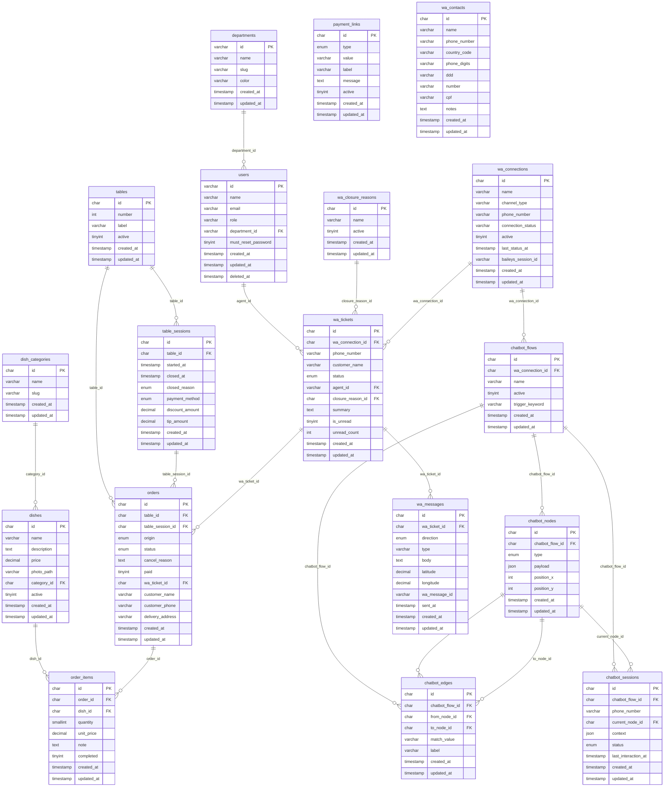

# Diagrama do Banco de Dados

> Diagrama ER gerado a partir do schema atual do banco `food` (MySQL). Renderiza como imagem no Obsidian e no GitHub.

```mermaid
erDiagram
    chatbot_edges {
        char id PK
        char chatbot_flow_id FK
        char from_node_id FK
        char to_node_id FK
        varchar match_value
        varchar label
        timestamp created_at
        timestamp updated_at
    }
    chatbot_flows {
        char id PK
        char wa_connection_id FK
        varchar name
        tinyint active
        varchar trigger_keyword
        timestamp created_at
        timestamp updated_at
    }
    chatbot_nodes {
        char id PK
        char chatbot_flow_id FK
        enum type
        json payload
        int position_x
        int position_y
        timestamp created_at
        timestamp updated_at
    }
    chatbot_sessions {
        char id PK
        char chatbot_flow_id FK
        varchar phone_number
        char current_node_id FK
        json context
        enum status
        timestamp last_interaction_at
        timestamp created_at
        timestamp updated_at
    }
    departments {
        varchar id PK
        varchar name
        varchar slug
        varchar color
        timestamp created_at
        timestamp updated_at
    }
    dish_categories {
        char id PK
        varchar name
        varchar slug
        timestamp created_at
        timestamp updated_at
    }
    dishes {
        char id PK
        varchar name
        text description
        decimal price
        varchar photo_path
        char category_id FK
        tinyint active
        timestamp created_at
        timestamp updated_at
    }
    order_items {
        char id PK
        char order_id FK
        char dish_id FK
        smallint quantity
        decimal unit_price
        text note
        tinyint completed
        timestamp created_at
        timestamp updated_at
    }
    orders {
        char id PK
        char table_id FK
        char table_session_id FK
        enum origin
        enum status
        text cancel_reason
        tinyint paid
        char wa_ticket_id FK
        varchar customer_name
        varchar customer_phone
        varchar delivery_address
        timestamp created_at
        timestamp updated_at
    }
    payment_links {
        char id PK
        enum type
        varchar value
        varchar label
        text message
        tinyint active
        timestamp created_at
        timestamp updated_at
    }
    table_sessions {
        char id PK
        char table_id FK
        timestamp started_at
        timestamp closed_at
        enum closed_reason
        enum payment_method
        decimal discount_amount
        decimal tip_amount
        timestamp created_at
        timestamp updated_at
    }
    tables {
        char id PK
        int number
        varchar label
        tinyint active
        timestamp created_at
        timestamp updated_at
    }
    users {
        varchar id PK
        varchar name
        varchar email
        varchar role
        varchar department_id FK
        tinyint must_reset_password
        timestamp created_at
        timestamp updated_at
        timestamp deleted_at
    }
    wa_closure_reasons {
        char id PK
        varchar name
        tinyint active
        timestamp created_at
        timestamp updated_at
    }
    wa_connections {
        char id PK
        varchar name
        varchar channel_type
        varchar phone_number
        varchar connection_status
        tinyint active
        timestamp last_status_at
        varchar baileys_session_id
        timestamp created_at
        timestamp updated_at
    }
    wa_contacts {
        char id PK
        varchar name
        varchar phone_number
        varchar country_code
        varchar phone_digits
        varchar ddd
        varchar number
        varchar cpf
        text notes
        timestamp created_at
        timestamp updated_at
    }
    wa_messages {
        char id PK
        char wa_ticket_id FK
        enum direction
        varchar type
        text body
        decimal latitude
        decimal longitude
        varchar wa_message_id
        timestamp sent_at
        timestamp created_at
        timestamp updated_at
    }
    wa_tickets {
        char id PK
        char wa_connection_id FK
        varchar phone_number
        varchar customer_name
        enum status
        varchar agent_id FK
        char closure_reason_id FK
        text summary
        tinyint is_unread
        int unread_count
        timestamp created_at
        timestamp updated_at
    }
    chatbot_flows ||--o{ chatbot_edges : "chatbot_flow_id"
    chatbot_nodes ||--o{ chatbot_edges : "from_node_id"
    chatbot_nodes ||--o{ chatbot_edges : "to_node_id"
    wa_connections ||--o{ chatbot_flows : "wa_connection_id"
    chatbot_flows ||--o{ chatbot_nodes : "chatbot_flow_id"
    chatbot_flows ||--o{ chatbot_sessions : "chatbot_flow_id"
    chatbot_nodes ||--o{ chatbot_sessions : "current_node_id"
    dish_categories ||--o{ dishes : "category_id"
    dishes ||--o{ order_items : "dish_id"
    orders ||--o{ order_items : "order_id"
    tables ||--o{ orders : "table_id"
    table_sessions ||--o{ orders : "table_session_id"
    wa_tickets ||--o{ orders : "wa_ticket_id"
    tables ||--o{ table_sessions : "table_id"
    departments ||--o{ users : "department_id"
    wa_tickets ||--o{ wa_messages : "wa_ticket_id"
    users ||--o{ wa_tickets : "agent_id"
    wa_closure_reasons ||--o{ wa_tickets : "closure_reason_id"
    wa_connections ||--o{ wa_tickets : "wa_connection_id"
```
