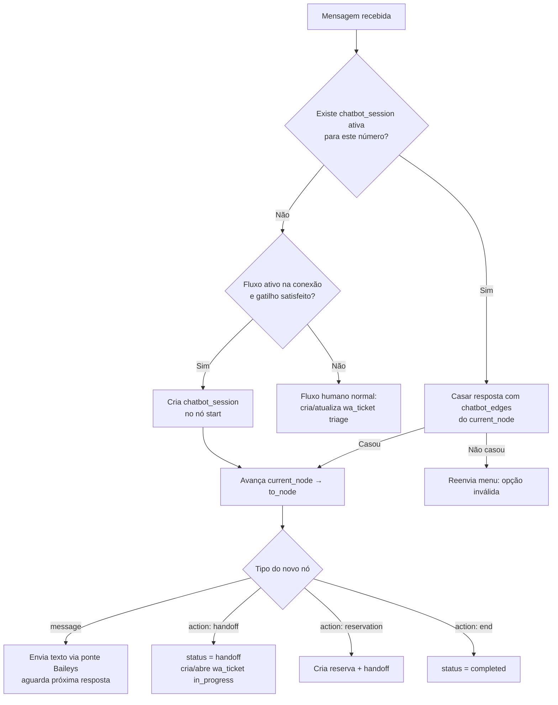

# Feature: chatbot-fluxo

> **Contexto:** Construtor visual de chatbot para WhatsApp. O `admin` monta, em um **canvas de fluxograma com blocos arrastáveis**, a árvore de respostas automáticas que o bot envia ao cliente. O motor (runtime) executa esse fluxo sobre a conexão Baileys já existente — sem custo por mensagem.
>
> **Depende de:** [schema.md](../database/schema.md) (`wa_tickets`, `wa_messages`, `wa_connections`), [atendimento.md](atendimento.md) (inbox/handoff humano), [auth.md](auth.md) (`role:admin`)
>
> **Relacionado:** [mesas.md](mesas.md) (ação "Reservar mesa" do fluxo), [project_overview.md](../project_overview.md) (módulo WhatsApp / Baileys)
>
> **Stack:** Laravel (motor + persistência) · Inertia.js + Vue 3 (construtor) · [Vue Flow](https://vueflow.dev) (`@vue-flow/core`, MIT) para o canvas · ponte Baileys Node (envio outbound já implementado)
>
> **Custo de WhatsApp:** R$ 0 por mensagem — Baileys é self-hosted, não-oficial. Não há cobrança por conversa (ao contrário da API oficial do WhatsApp Business).

---

## Objetivo

Permitir que o `admin`:

1. **Desenhe** o fluxo de atendimento automático em um canvas visual (nós arrastáveis ligados por setas).
2. **Defina manualmente** o texto de cada mensagem que o bot envia (nó de **Interação**).
3. **Ramifique** o fluxo conforme a resposta do cliente a um menu numerado (nó de **Condição**).
4. **Acione ações** ao fim de um ramo — ex.: registrar uma reserva de mesa, ou **transferir para um atendente humano** (handoff).
5. **Ative/desative** o bot por conexão WhatsApp, sem mexer em código.

> **Decisão central:** começar com **menu numerado** (cliente responde `1`, `2`, `3`). Casamento de resposta é comparação de string — **zero dependência de IA**. Interpretação de texto livre fica para uma fase futura opcional (aí sim com a API da Claude).

---

## Conceitos (vocabulário do construtor)

| Termo na UI | Tipo de nó | O que faz |
|---|---|---|
| **Etapa** | (agrupador visual) | Um ponto do fluxo; contém uma Interação e, opcionalmente, Condições de saída |
| **Interação** | `message` | Mensagem de texto **definida manualmente** pelo admin que o bot envia |
| **Condição** | `choice` (aresta) | Ramo de saída: "se o cliente responder `2`, vá para a Etapa X" |
| **Ação** | `action` | Efeito ao chegar no nó: `handoff` (chama humano), `reservation` (abre reserva), `end` (encerra) |
| **Início** | `start` | Nó único de entrada; dispara quando o gatilho ocorre |

### Exemplo de fluxo (o que o cliente vê)

```
Bot:  Olá! Bem-vindo à 4Food 🍔 Como posso ajudar?
      1 — Ver cardápio
      2 — Acompanhar meu pedido
      3 — Reservar uma mesa
      0 — Falar com um atendente

Cliente: 3

Bot:  Legal! Para quantas pessoas seria a reserva?
...
      → ação: cria registro de reserva + handoff para o admin confirmar
```

---

## Modelo de dados

Quatro tabelas novas. O **fluxo desenhado** vira um grafo (`nodes` + `edges`); o **estado de cada cliente** vive em `chatbot_sessions`.

### `chatbot_flows`

Um fluxo publicável. Vinculado a uma conexão WhatsApp.

```php
Schema::create('chatbot_flows', function (Blueprint $table) {
    $table->uuid('id')->primary();
    $table->foreignUuid('wa_connection_id')->nullable()
          ->constrained('wa_connections')->nullOnDelete();
    $table->string('name');
    $table->boolean('active')->default(false);   // só um fluxo ativo por conexão
    $table->string('trigger_keyword')->nullable(); // null = dispara em qualquer 1ª mensagem
    $table->timestamps();
});
```

### `chatbot_nodes`

Cada bloco do canvas. `position_x/y` preservam o layout visual; `payload` guarda o conteúdo (texto da mensagem, tipo de ação, etc.).

```php
Schema::create('chatbot_nodes', function (Blueprint $table) {
    $table->uuid('id')->primary();
    $table->foreignUuid('chatbot_flow_id')->constrained()->cascadeOnDelete();
    $table->enum('type', ['start', 'message', 'action']);
    $table->json('payload')->nullable();   // { text } | { action: 'handoff'|'reservation'|'end' }
    $table->integer('position_x')->default(0);
    $table->integer('position_y')->default(0);
    $table->timestamps();
});
```

### `chatbot_edges`

Ligações entre nós. `match_value` é a opção digitada pelo cliente (`"1"`, `"2"`...); `null` = transição automática (sem esperar resposta).

```php
Schema::create('chatbot_edges', function (Blueprint $table) {
    $table->uuid('id')->primary();
    $table->foreignUuid('chatbot_flow_id')->constrained()->cascadeOnDelete();
    $table->foreignUuid('from_node_id')->constrained('chatbot_nodes')->cascadeOnDelete();
    $table->foreignUuid('to_node_id')->constrained('chatbot_nodes')->cascadeOnDelete();
    $table->string('match_value')->nullable(); // "1".."9" | null (auto)
    $table->string('label')->nullable();       // "Ver cardápio" (exibido no canvas)
    $table->timestamps();
});
```

### `chatbot_sessions`

**O coração do runtime.** Onde cada cliente está agora no fluxo.

```php
Schema::create('chatbot_sessions', function (Blueprint $table) {
    $table->uuid('id')->primary();
    $table->foreignUuid('chatbot_flow_id')->constrained()->cascadeOnDelete();
    $table->string('phone_number');                 // E.164 / JID do cliente
    $table->foreignUuid('current_node_id')->nullable()
          ->constrained('chatbot_nodes')->nullOnDelete();
    $table->json('context')->nullable();            // variáveis coletadas (nº pessoas, etc.)
    $table->enum('status', ['active', 'handoff', 'completed'])->default('active');
    $table->timestamp('last_interaction_at')->nullable();
    $table->timestamps();
});
```

**Índice-chave:** `[phone_number, status]` — buscar a sessão ativa de um número a cada mensagem recebida.

---

## Runtime — o motor (a parte que importa de verdade)

O ponto de integração é o **inbound já existente**: [`IncomingWhatsAppMessageService::handleInbound()`](../../app/Services/WhatsApp/IncomingWhatsAppMessageService.php). Antes de criar/atualizar o ticket humano, o motor decide se o **bot** assume.



### Regras do motor

| Situação | Comportamento |
|---|---|
| Número sem sessão + 1ª mensagem + fluxo ativo | Cria sessão no `start`, envia 1ª `message` |
| Resposta casa um `match_value` | Avança; executa o nó destino |
| Resposta **não** casa nenhuma opção | Reenvia a mensagem atual com aviso "opção inválida" (máx. N tentativas → handoff) |
| Nó `action: handoff` | `session.status = handoff`; cria/atualiza `wa_tickets` (`triage`/`in_progress`) para o humano assumir |
| Nó `action: end` | `session.status = completed`; nova mensagem futura reinicia o fluxo |
| Sessão inativa há > X horas | Job de timeout encerra (`completed`) — fase 2 |
| Toda mensagem (bot ou cliente) | Continua gravando em `wa_messages` (`inbound`/`outbound`) para histórico no inbox |

### Envio outbound

A ponte Node **já envia mensagens** ([sessionManager.js](../../services/baileys/src/sessions.js) via [InboxController](../../app/Http/Controllers/WhatsApp/InboxController.php)). O motor reutiliza esse mesmo caminho — não precisa de infra nova de envio, só chamar o endpoint de send da ponte e registrar a `wa_message` `outbound`.

---

## Handoff bot ↔ humano (decisão de produto obrigatória)

Hoje **toda** mensagem cria um `wa_ticket` em `triage` para um atendente. Com o bot na frente, isso muda: o bot atende primeiro e **só escala quando o fluxo manda**.

| Gatilho de handoff | Efeito |
|---|---|
| Cliente escolhe "Falar com atendente" (`0`) | `session → handoff`; ticket vira `in_progress`/`triage` na inbox |
| Nó `action: reservation` concluído | Cria registro de reserva + escala para o admin confirmar |
| N respostas inválidas seguidas | Escala automática (evita cliente preso no menu) |
| Conexão **sem** fluxo ativo | Bot não atua; comportamento atual 100% preservado |

> Enquanto `session.status = active`, o ticket **não** deve aparecer como "novo" na inbox humana (evita atendente e bot brigando pela mesma conversa). Ao escalar, o ticket entra na inbox normalmente.

---

## Construtor visual (frontend)

> **Não construir drag-and-drop do zero.** Usar **Vue Flow** (`@vue-flow/core`, MIT, grátis) — é exatamente "nós arrastáveis + setas de ligação".

### Tela `GET /admin/chatbot` → `Pages/Admin/ChatbotBuilder.vue`

```
┌─────────────────────────────────────────────────────────────────────┐
│ [sidebar] │ [topbar] Chatbot · Fluxo "Atendimento principal"  [Ativo]│
│           ├─────────────────────────────────────────────────────────│
│           │ [+ Interação] [+ Ação] [Salvar] [Testar]   Conexão: ▼   │
│           ├──────────────────────────────────┬──────────────────────│
│           │                                  │  Painel do nó         │
│           │   ┌─────────┐                     │  selecionado:        │
│           │   │ Início  │                     │  • Texto da mensagem │
│           │   └────┬────┘                     │  • Opções (1,2,3...) │
│           │        │                          │  • Tipo de ação      │
│           │   ┌────▼─────────┐                │                      │
│           │   │ Menu inicial │  (canvas Vue   │                      │
│           │   │ 1 2 3 0      │   Flow, pan/    │                      │
│           │   └─┬──┬──┬──┬───┘   zoom)         │                      │
│           │     ▼  ▼  ▼  ▼                     │                      │
│           └──────────────────────────────────┴──────────────────────│
└─────────────────────────────────────────────────────────────────────┘
```

| Elemento | Comportamento |
|---|---|
| Canvas | Vue Flow: arrastar nós, criar arestas ligando saídas → entradas |
| Nó de Interação | Card com preview do texto + lista de opções (vira `handles` de saída) |
| Painel lateral | Edita o nó selecionado: textarea da mensagem, opções, ação |
| Salvar | Persiste nós/arestas/posições via `PUT /admin/chatbot/{flow}` |
| Ativar | Toggle `active` (valida: só um ativo por conexão) |
| Testar | (fase 2) simulador in-app sem mandar WhatsApp de verdade |

### Persistência do grafo

Salvar = enviar o array completo de `nodes` (com `position_x/y` e `payload`) e `edges` (com `match_value`/`label`). O controller faz upsert transacional e remove o que sumiu do canvas. Carregar = devolver o mesmo formato para o Vue Flow remontar.

---

## Rotas

```php
// Admin — construtor
Route::middleware(['role:admin'])->prefix('admin')->name('admin.')->group(function () {
    Route::get('/chatbot',               [ChatbotController::class, 'index'])->name('chatbot.index');
    Route::post('/chatbot',              [ChatbotController::class, 'store'])->name('chatbot.store');
    Route::put('/chatbot/{flow}',        [ChatbotController::class, 'update'])->name('chatbot.update'); // salva grafo
    Route::post('/chatbot/{flow}/toggle',[ChatbotController::class, 'toggle'])->name('chatbot.toggle');
    Route::delete('/chatbot/{flow}',     [ChatbotController::class, 'destroy'])->name('chatbot.destroy');
});
```

O motor **não tem rota** — ele é invocado de dentro do serviço de inbound (webhook da ponte), não por HTTP do admin.

| Arquivo | Ação |
|---|---|
| `database/migrations/..._create_chatbot_flows_table.php` | Criar |
| `database/migrations/..._create_chatbot_nodes_table.php` | Criar |
| `database/migrations/..._create_chatbot_edges_table.php` | Criar |
| `database/migrations/..._create_chatbot_sessions_table.php` | Criar |
| `app/Services/WhatsApp/ChatbotEngine.php` | Criar — máquina de estados (núcleo) |
| `app/Services/WhatsApp/IncomingWhatsAppMessageService.php` | Alterar — consultar `ChatbotEngine` antes do fluxo humano |
| `app/Http/Controllers/Admin/ChatbotController.php` | Criar — CRUD do grafo |
| `resources/js/Pages/Admin/ChatbotBuilder.vue` | Criar — canvas |
| `resources/js/Components/Chatbot/*` | Nós custom, painel lateral |
| `routes/web.php` | Registrar rotas admin |
| `package.json` | Adicionar `@vue-flow/core` |
| `docs/database/schema.md` | Documentar as 4 tabelas |

---

## Fases de entrega

### Fase 1 — Motor (sem canvas) ⚠️ risco real do projeto

- [ ] Migrations das 4 tabelas
- [ ] `ChatbotEngine` com fluxo **hardcoded** (menu 1/2/3/0)
- [ ] Integração no `IncomingWhatsAppMessageService` (bot antes do humano)
- [ ] Handoff funcionando (opção `0` → ticket na inbox)
- [ ] Mensagens do bot gravadas em `wa_messages` (`outbound`)
- [ ] Teste: conversa real no WhatsApp percorre o menu e escala

> Provar a **máquina de estados por contato** antes de investir em UI. É aqui que mora a dificuldade.

### Fase 2 — Construtor visual

- [ ] `@vue-flow/core` instalado
- [ ] `ChatbotBuilder.vue` carrega/salva o grafo
- [ ] Painel lateral edita texto + opções + ação
- [ ] Toggle ativar (um fluxo por conexão)
- [ ] Item "Chatbot" no `AppSidebar`

### Fase 3 — Refinos (opcional)

- [ ] Simulador "Testar" in-app
- [ ] Ação `reservation` integrada com [mesas.md](mesas.md)
- [ ] Timeout de sessão ociosa
- [ ] **Texto livre com IA** (API da Claude) — único item com custo

---

## Casos de teste

| # | Passos | Resultado esperado |
|---|---|---|
| 1 | Conexão sem fluxo ativo recebe mensagem | Comportamento atual: ticket em `triage`, bot não atua |
| 2 | Conexão com fluxo ativo, 1ª mensagem | Bot responde menu inicial; cria `chatbot_session` |
| 3 | Cliente responde `1` | Avança para a Etapa ligada à opção 1 |
| 4 | Cliente responde `9` (inexistente) | Bot reenvia menu com "opção inválida" |
| 5 | Cliente responde `0` (atendente) | `session = handoff`; ticket aparece na inbox humana |
| 6 | 3 respostas inválidas seguidas | Handoff automático |
| 7 | Admin salva grafo e recarrega | Canvas remonta nós nas mesmas posições |
| 8 | Dois fluxos ativos na mesma conexão | Bloqueado: só um `active` por conexão |
| 9 | Sessão `completed` recebe nova mensagem | Reinicia o fluxo do `start` |

---

## Status de implementação

- [ ] `docs/features/chatbot-fluxo.md` aprovado
- [ ] Fase 1 — motor + handoff
- [ ] Fase 2 — construtor visual
- [ ] Fase 3 — refinos / IA (opcional)

---

## Próxima feature sugerida

**chatbot-reserva** — detalhar o ramo "Reservar mesa": coleta (data, horário, nº pessoas), tabela `table_reservations`, novo status `reserved` no kanban de [mesas.md](mesas.md) e confirmação pelo admin.
