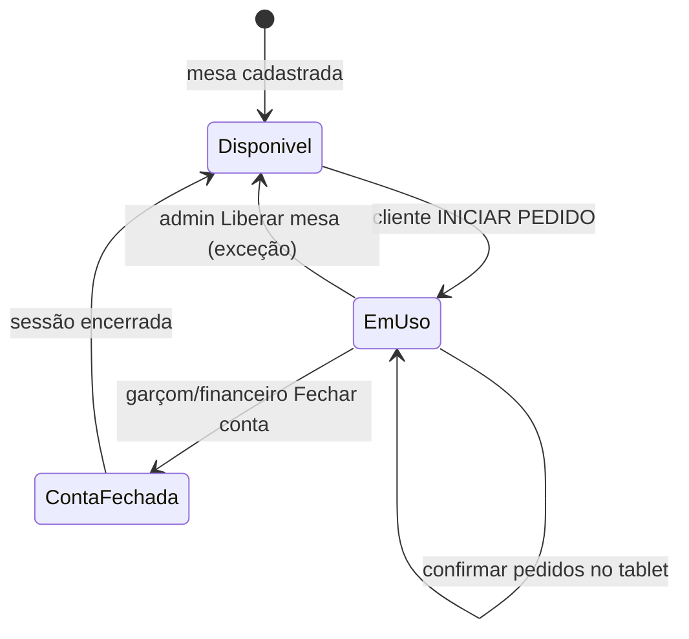

# Feature: mesas

> **Contexto:** Gestão das mesas físicas do restaurante — configuração no admin, visualização operacional em cards e ciclo de **ocupação iniciado pelo cliente** no tablet (`/tablet?mesa=N`).
>
> **Depende de:** `docs/database/schema.md` (`tables`, `orders`, `order_items`), `docs/features/tablet.md`, `docs/features/pedidos.md`, `docs/features/auth.md`
>
> **Relacionado:** `docs/project_overview.md` §3.4 (Finance), §3.5 (Waiter), §3.7 (Tablet); fechamento de conta (módulo financeiro/garçom — feature futura dedicada)
>
> **Stack:** Inertia.js + Vue 3 (admin), rota pública no tablet
>
> **URL tablet:** `http://127.0.0.1:8000/tablet?mesa=1`

---

## Objetivo

Permitir que o restaurante:

1. **Configure** quantas mesas existem (número, rótulo opcional) no painel admin.
2. **Visualize** todas as mesas em um grid de cards com status legível (`Disponível`, `Em uso`, etc.).
3. Deixe o **cliente na mesa** iniciar a sessão de consumo pelo tablet — botão **INICIAR PEDIDO** — marcando a mesa como **em uso**.
4. **Libere a mesa** após o ciclo de atendimento (conta fechada), para que um novo grupo possa iniciar outro pedido na mesma mesa física.

---

## Visão geral do ciclo de vida



| Estado operacional | Quem altera | Significado para o cliente |
|---|---|---|
| **Disponível** | Padrão / após encerrar sessão | Tela de boas-vindas com **INICIAR PEDIDO** |
| **Em uso** | Cliente ao iniciar | Cardápio e carrinho (`Order.vue`) |
| **Conta em aberto** (subestado) | Pedidos enviados, `paid = false` | Continua no cardápio; admin vê total |
| **Encerrada** | Fechar conta ou liberar mesa | Volta a **Disponível** no tablet |

> **Decisão de modelagem:** usar tabela `table_sessions` (sessão de mesa), separada de `orders`. Um pedido (`orders`) pertence a uma sessão; a mesa fica **em uso** enquanto existir sessão com `closed_at IS NULL`. Isso resolve reabrir a mesa após o fechamento sem apagar histórico de pedidos.

---

## Modelo de dados

### Tabela existente: `tables`

Mantém cadastro estático da mesa física (já existe na migration `0001_01_01_000005`).

| Coluna | Tipo | Notas |
|---|---|---|
| `id` | uuid PK | |
| `number` | unsigned int unique | 1–99 (alinhar validação do tablet) |
| `label` | string nullable | ex.: `"Varanda 3"`; fallback UI: `Mesa {number}` |
| `active` | boolean default true | **novo** — mesa desativada não aceita sessão no tablet |
| `timestamps` | | |

**Seed:** `RestaurantTableSeeder` — mesas 1 a 10 (já implementado).

### Nova tabela: `table_sessions`

Representa **uma rodada de atendimento** na mesa (um grupo de clientes sentados).

```php
Schema::create('table_sessions', function (Blueprint $table) {
    $table->uuid('id')->primary();
    $table->foreignUuid('table_id')->constrained('tables')->restrictOnDelete();
    $table->timestamp('started_at');
    $table->timestamp('closed_at')->nullable();
    $table->enum('closed_reason', ['paid', 'admin_release', 'timeout'])->nullable();
    $table->timestamps();
});
```

| Campo | Uso |
|---|---|
| `started_at` | Momento do **INICIAR PEDIDO** |
| `closed_at` | Preenchido ao fechar conta ou liberar mesa |
| `closed_reason` | Auditoria: `paid` (fluxo normal), `admin_release` (exceção), `timeout` (fase 2) |

**Índices sugeridos:**

- `table_id` + `closed_at` — obter sessão ativa: `WHERE table_id = ? AND closed_at IS NULL LIMIT 1`
- Composto único parcial (opcional, Postgres): uma sessão aberta por mesa — validar também na aplicação

### Alteração em `orders`

```php
$table->foreignUuid('table_session_id')
      ->nullable()
      ->after('table_id')
      ->constrained('table_sessions')
      ->nullOnDelete();
```

- Todo `POST /tablet/orders` deve vincular o pedido à **sessão ativa** da mesa.
- Pedidos antigos (antes da feature) permanecem com `table_session_id = null`.

### Status derivado (sem coluna `status` em `tables`)

O status exibido nos cards é **calculado**:

| Condição | Label UI | Cor sugerida |
|---|---|---|
| `tables.active = false` | `Inativa` | cinza `#9ca3af` |
| Sem sessão aberta | `Disponível` | verde `#1D9E75` |
| Sessão aberta + nenhum pedido | `Em uso` | âmbar `#EF9F27` |
| Sessão aberta + `orders` com `paid = false` | `Conta em aberto` | laranja `#D85A30` + valor total |
| Sessão aberta + todos pedidos `paid = true` mas sessão não fechada | `Aguardando liberação` | âmbar — garçom deve fechar conta |

> Após **Fechar conta**, a aplicação define `closed_at` na sessão → mesa volta a **Disponível** no tablet.

---

## Reabrir mesa após pedido finalizado (decisão)

**Problema:** hoje, com apenas `orders` e `paid`, não há fronteira clara entre “mesmo grupo pedindo de novo” e “novo grupo na mesa 5”. O tablet abre direto no cardápio.

**Solução adotada nesta spec — sessão de mesa:**

| Momento | Comportamento |
|---|---|
| Cliente chega, mesa livre | `GET /tablet?mesa=N` → tela **Welcome** → **INICIAR PEDIDO** |
| Após iniciar | `POST /tablet/session/start` → cria `table_sessions` → redirect/render **Order** |
| Durante a refeição | Vários `POST /tablet/orders` na mesma sessão (já previsto em `tablet.md`: múltiplos pedidos) |
| Cozinha finaliza itens | `orders.status` → `ready` — **não** libera a mesa |
| Garçom/financeiro e o admin fecha conta | Marca pedidos `paid = true` **e** `table_sessions.closed_at = now()` |
| Próximo grupo | Tablet mostra **Welcome** de novo com **INICIAR PEDIDO** |

**Cenários de borda:**

| Cenário | Comportamento |
|---|---|
| Tablet recarregado com sessão aberta | Pular Welcome; ir direto ao cardápio (`Order.vue`) |
| Mesa em uso e outro dispositivo abre a URL | Mesma mesa física = mesmo tablet; mostrar cardápio (sessão já existe). Não permitir segundo `session/start` |
| Conta paga mas sessão não fechada (bug/legado) | Admin card mostra `Aguardando liberação`; botão **Encerrar sessão** |
| Mesa sem pedidos, cliente abandona | Admin **Liberar mesa** → `closed_reason = admin_release` |
| Mesa inativa no cadastro | Tablet: tela “Mesa indisponível” (não confundir com `MissingMesa`) |

**Fase 2 (opcional):** timeout automático (ex.: 4h sem pedido novo) com `closed_reason = timeout` — não bloquear MVP.

---

## Módulo 1 — Tablet (cliente)

### Fluxo

```
GET /tablet?mesa=N
        │
        ├─ mesa inválida (ausente, não numérica, fora 1–99)
        │       └─► MissingMesa.vue (existente)
        │
        ├─ mesa não existe em tables OU active = false
        │       └─► Tablet/TableUnavailable.vue (novo)
        │
        ├─ sessão ativa existe
        │       └─► Tablet/Order.vue (existente)
        │
        └─ sem sessão ativa
                └─► Tablet/Welcome.vue (novo)
                        │
                        [ INICIAR PEDIDO ]
                        │
                        POST /tablet/session/start { mesa }
                        │
                        └─► Order.vue
```

### Tela Welcome (`Pages/Tablet/Welcome.vue`)

| Elemento | Especificação |
|---|---|
| Fundo | `#f5f6f8` (token tablet) |
| Título | `Mesa {number}` |
| Subtítulo | `Bem-vindo! Toque para começar seu pedido.` |
| CTA principal | Botão **INICIAR PEDIDO** — largura confortável, min-height 56px, fundo `#1a1a1a`, texto branco |
| Logo / marca | Opcional, centralizado acima do título |
| Sem autenticação | Rota pública |

**Ação do botão:**

1. `POST /tablet/session/start` com body `{ "mesa": N }`
2. Sucesso `201` → Inertia visit ou `router.reload` para `Order` com mesma query `?mesa=N`
3. Erro `409` — sessão já aberta (race) → redirecionar para `Order`
4. Erro `422` — mesa inexistente/inativa → `TableUnavailable`

### API tablet

| Método | URI | Body | Resposta |
|---|---|---|---|
| `GET` | `/tablet?mesa=N` | — | Inertia: `Welcome` \| `Order` \| `MissingMesa` \| `TableUnavailable` |
| `POST` | `/tablet/session/start` | `{ mesa: int }` | `201 { session_id }` ou redirect Inertia |
| `POST` | `/tablet/orders` | `{ mesa, items[] }` | **Alterar:** exige sessão ativa; preenche `table_session_id` |

**Validação `session/start`:**

- `mesa`: required, integer, 1–99
- `tables.number = mesa` existe e `active = true`
- Não existe `table_sessions` com `table_id` e `closed_at IS NULL`
- Criar sessão em transação

**Validação `orders/store` (extensão):**

- Além das regras atuais (`TabletOrderController@store`), buscar sessão ativa; se ausente → `422` com mensagem `Inicie o pedido na mesa antes de enviar itens.`

### Props Inertia — `Order.vue`

Manter props atuais (`mesa`, `categories`, `dishes`) e adicionar opcional:

| Prop | Tipo | Uso |
|---|---|---|
| `session_id` | string (uuid) | Debug / futuro polling; não exibir ao cliente |

---

## Módulo 2 — Admin: duas opções de layout

O admin pode alternar entre **Salão** e **Operacional** via toggle no topo (`TablesLayoutSwitch.vue`). Mesma API, mesmos dados — só muda a UI.

| Layout | Rota | Page | Perfil de uso |
|---|---|---|---|
| **Salão** (A) | `GET /admin/mesas` | `Tables.vue` | Visão geral do restaurante; grid + painel lateral |
| **Operacional** (B) | `GET /admin/mesas/operacional` | `TablesKanban.vue` | Fluxo de pico; colunas por status + barra inferior |

---

### Layout A — Salão (split view)

#### Rota e acesso

| Item | Valor |
|---|---|
| URI | `GET /admin/mesas` |
| Nome | `admin.mesas.index` |
| Controller | `TablesController@index` |
| Page | `Pages/Admin/Tables.vue` |

> **Fase 2:** mesma listagem para `finance` e `waiter`, reutilizando componentes.

#### Princípio

Split view fixo — salão à esquerda, detalhe à direita. **Sem drawer.** Painel sempre visível (placeholder quando nada selecionado).

#### Estrutura

```
┌─────────────────────────────────────────────────────────────────────────┐
│ [sidebar] │ [topbar] Mesas · 10 mesas cadastradas                       │
│           ├─────────────────────────────────────────────────────────────│
│           │ [ Salão | Operacional ]  [🔍 Buscar...]        [ Nova mesa ] │
│           │ ( Todas 10 ) ( Disponíveis 6 ) ( Em uso 2 ) ...              │
│           ├───────────────────────────────────────┬───────────────────────│
│           │  grid de cards (salão)              │  painel de detalhe    │
│           └───────────────────────────────────────┴───────────────────────│
└─────────────────────────────────────────────────────────────────────────┘
```

**Desktop:** grid ~70% + painel 300px sticky.  
**Mobile:** grid em cima; detalhe abaixo ao selecionar.

#### Barra superior (A)

| Elemento | Comportamento |
|---|---|
| Toggle layout | `Salão` \| `Operacional` |
| Busca | Filtra por `number` ou `label` |
| Pills de filtro | Com contagem por status |
| **Nova mesa** | Modal de cadastro |

#### Grid + painel (A)

Ver seções anteriores: `TableStatusCard.vue`, painel inline à direita, mesmas ações.

---

### Layout B — Operacional (kanban + dock)

#### Rota e acesso

| Item | Valor |
|---|---|
| URI | `GET /admin/mesas/operacional` |
| Nome | `admin.mesas.operacional` |
| Controller | `TablesController@indexOperacional` |
| Page | `Pages/Admin/TablesKanban.vue` |

#### Princípio

Inspirado na tela de **Pedidos** (kanban). Mesas agrupadas **por coluna de status**, não por número. Ao clicar, ações aparecem numa **barra fixa na parte inferior** da tela — não lateral, não modal.

#### Estrutura

```
┌─────────────────────────────────────────────────────────────────────────┐
│ [sidebar] │ [topbar] Mesas · 10 mesas · visão operacional               │
│           ├─────────────────────────────────────────────────────────────│
│           │ [ Salão | Operacional ]  [🔍 Filtrar...]         [ Nova mesa ]│
│           ├─────────────────────────────────────────────────────────────│
│           │ Disponível │ Em uso │ Conta aberta │ Aguardando │ Inativas   │
│           │    (6)     │  (2)   │     (1)      │    (1)     │    (0)     │
│           │  [chip 1]  │ [chip2]│  [chip 5]    │  [chip 7]  │            │
│           │  [chip 3]  │        │  R$ 52,00    │            │            │
│           │  ...       │        │              │            │            │
├───────────┴─────────────────────────────────────────────────────────────┤
│  ✕  │ [5] Mesa 5 · Varanda │ Conta aberta · 14:32 · 2p │ R$ 52,00      │
│     │                        [ Fechar conta ] [ Liberar ] [ Editar ]     │
└─────────────────────────────────────────────────────────────────────────┘
```

#### Colunas kanban

| Coluna | `status` | Cor topo |
|---|---|---|
| Disponível | `available` | `#1d9e75` |
| Em uso | `in_use` | `#ef9f27` |
| Conta aberta | `open_bill` | `#d85a30` |
| Aguardando | `pending_release` | `#6b7280` |
| Inativas | `inactive` | `#d1d5db` |

- Scroll horizontal se não couber na tela
- Cada coluna: header com label + count; corpo scrollável vertical
- Chip compacto (`TableKanbanChip.vue`): número, label, total ou horário

#### Barra inferior (dock)

Aparece com animação slide-up ao selecionar mesa. Fecha com ✕ ou segundo clique no chip.

| Área | Conteúdo |
|---|---|
| Esquerda | Quadrado com número + nome da mesa |
| Centro | Status pill, horário da sessão, qtd pedidos |
| Destaque | Total em aberto (grande, laranja) |
| Direita | Botões: Fechar conta, Liberar, Editar, Excluir (mesmas regras do layout A) |

**Mobile:** dock empilha verticalmente; botões em largura total.

#### Busca (B)

Só campo de texto — **sem pills de filtro**. A busca reduz chips em todas as colunas ao mesmo tempo.

---

### Componentes compartilhados (A e B)

| Componente | Uso |
|---|---|
| `useTablesAdmin.js` | Estado, filtros, ações (release, close, CRUD) |
| `TablesLayoutSwitch.vue` | Toggle Salão / Operacional |
| `TableFormModal.vue` | Criar/editar mesa |
| `TableStatusCard.vue` | Layout A |
| `TableKanbanChip.vue` | Layout B |

### Topbar (ambos)

| Prop | Valor |
|---|---|
| `title` | `"Mesas"` |
| `subtitle` | A: `"{n} mesas cadastradas"` · B: `"{n} mesas · visão operacional"` |
| `roleBadge` | `"Admin"` |

### Payload Inertia (ambos)

Sem alteração de contrato — `TablesController@indexPayload()`.

---

## Módulo 3 — Admin: configurar mesas

### Ações

| Ação | UI | API |
|---|---|---|
| Criar mesa | Botão **+ Nova mesa** → modal | `POST /admin/mesas` |
| Editar | Ícone no card ou no drawer | `PUT /admin/mesas/{table}` |
| Ativar / desativar | Toggle no formulário | `active` boolean |
| Excluir | Com confirmação | `DELETE /admin/mesas/{table}` |

### Formulário (modal)

| Campo | Validação |
|---|---|
| Número | required, integer, 1–99, unique em `tables.number` |
| Rótulo | nullable, string, max 80 |
| Ativa | boolean, default true |

**Regras:**

- Não excluir mesa com sessão aberta → `422` `Encerre a sessão antes de excluir a mesa.`
- Não excluir mesa com pedidos históricos → preferir **desativar** (`active = false`) em vez de delete; se delete permitido, apenas sem pedidos vinculados (MVP: só desativar)
- Alterar número: permitido se não houver sessão aberta; atualizar QR/impressão do tablet manualmente

### Liberar mesa (exceção operacional)

| Item | Valor |
|---|---|
| URI | `POST /admin/mesas/{table}/release` |
| Efeito | Fecha sessão ativa (`closed_at`, `closed_reason = admin_release`); opcionalmente cancela pedidos `pending` não enviados à cozinha |
| UI | Botão **Liberar sem fechar conta** no painel de detalhe — confirmação “Isso encerra o atendimento atual sem fechar conta no caixa?” |

> Usar apenas quando o cliente saiu sem pagar / sessão fantasma. Fechamento financeiro normal usa **Fechar conta** (feature caixa).

---

## Integração com fechamento de conta (caixa / garçom)

Esta feature **define** o contrato; a UI de caixa pode ser entregue depois.

**`POST /admin/mesas/{table}/close-account`** (ou rota compartilhada finance/waiter):

1. Validar sessão ativa
2. Transação:
   - `UPDATE orders SET paid = true WHERE table_session_id = ? AND paid = false`
   - `UPDATE table_sessions SET closed_at = now(), closed_reason = 'paid' WHERE id = ?`
3. Resposta `200` + mesa passa a `Disponível` no próximo load do tablet

Alinhar com `docs/project_overview.md`: total em aberto só considera `paid = false`.

---

## Rotas (resumo)

```php
// Tablet (público)
Route::get('/tablet', [TabletOrderController::class, 'index']);
Route::post('/tablet/session/start', [TabletSessionController::class, 'store']);
Route::post('/tablet/orders', [TabletOrderController::class, 'store']);

// Admin
Route::middleware(['role:admin'])->prefix('admin')->group(function () {
    Route::get('/mesas/operacional', [TablesController::class, 'indexOperacional'])->name('mesas.operacional');
    Route::post('/mesas', [TablesController::class, 'store'])->name('mesas.store');
    Route::put('/mesas/{table}', [TablesController::class, 'update'])->name('mesas.update');
    Route::delete('/mesas/{table}', [TablesController::class, 'destroy'])->name('mesas.destroy');
    Route::post('/mesas/{table}/release', [TablesController::class, 'release'])->name('mesas.release');
    Route::post('/mesas/{table}/close-account', [TablesController::class, 'closeAccount'])->name('mesas.closeAccount');
});
```

---

## Arquivos a criar / alterar

| Arquivo | Ação |
|---|---|
| `database/migrations/..._create_table_sessions_table.php` | Criar |
| `database/migrations/..._add_active_to_tables_table.php` | Criar |
| `database/migrations/..._add_table_session_id_to_orders_table.php` | Criar |
| `app/Http/Controllers/Tablet/TabletSessionController.php` | Criar |
| `app/Http/Controllers/Admin/TablesController.php` | Criar |
| `app/Http/Controllers/Tablet/TabletOrderController.php` | Alterar `index` + `store` |
| `resources/js/Pages/Tablet/Welcome.vue` | Criar |
| `resources/js/Pages/Tablet/TableUnavailable.vue` | Criar |
| `resources/js/Pages/Admin/Tables.vue` | Layout A — salão |
| `resources/js/Pages/Admin/TablesKanban.vue` | Layout B — operacional |
| `resources/js/composables/useTablesAdmin.js` | Lógica compartilhada |
| `resources/js/Components/TablesLayoutSwitch.vue` | Toggle A / B |
| `resources/js/Components/TableKanbanChip.vue` | Chip layout B |
| `resources/js/Components/TableStatusCard.vue` | Criar |
| `resources/js/Components/TableFormModal.vue` | Criar (opcional fase 1.1) |
| `resources/js/Components/AppSidebar.vue` | `tables.route` → `/admin/mesas` |
| `routes/web.php` | Registrar rotas |
| `docs/database/schema.md` | Documentar `table_sessions` e `tables.active` |

### CSS

- `<style scoped src="./styles/....css"></style>` em cada `.vue` novo
- Tokens alinhados ao admin (`#f6f7f9`, cards `#fff`, borda `#eceef0`)

---

## MVP — checklist de entrega

### Fase A — Fundação (backend + tablet welcome)

- [ ] Migrations `table_sessions`, `tables.active`, `orders.table_session_id`
- [ ] `POST /tablet/session/start`
- [ ] `GET /tablet` renderiza `Welcome` ou `Order` conforme sessão
- [ ] `POST /tablet/orders` exige sessão ativa
- [ ] `Welcome.vue` com **INICIAR PEDIDO**
- [ ] Teste manual: mesa 1 disponível → iniciar → em uso → enviar pedido → reload mantém cardápio

### Fase B — Admin cards

- [ ] `GET /admin/mesas` com grid de cards (todas as mesas seedadas)
- [ ] Badge **Disponível** / **Em uso** / **Conta em aberto**
- [ ] Sidebar Mesas ativa
- [ ] Filtro e busca client-side

### Fase C — Configuração

- [ ] CRUD mesas (criar, editar label, ativar/desativar)
- [ ] `POST /admin/mesas/{id}/release`
- [ ] `POST /admin/mesas/{id}/close-account` (botão no painel de detalhe)

### Fora do escopo (não implementar no MVP)

- QR code por mesa
- Polling em tempo real no grid admin (reload manual ou F5 no MVP)
- Timeout automático de sessão
- Mapa visual do salão (posição x/y da mesa)
- App garçom/financeiro dedicado (reutilizar rotas depois)
- Vincular mesa a ticket WhatsApp

---

## Casos de teste

| # | Passos | Resultado esperado |
|---|---|---|
| 1 | Abrir `/tablet?mesa=1` sem sessão | Tela Welcome, botão **INICIAR PEDIDO** |
| 2 | Clicar INICIAR PEDIDO | Cardápio; admin card Mesa 1 = **Em uso** |
| 3 | Confirmar pedido no tablet | Pedido em `/admin/orders`; mesa pode mostrar **Conta em aberto** |
| 4 | Fechar conta no admin | Sessão encerrada; tablet volta ao Welcome |
| 5 | INICIAR PEDIDO de novo | Nova sessão; novo pedido não mistura com sessão anterior |
| 6 | `/tablet?mesa=999` | `MissingMesa.vue` |
| 7 | Mesa desativada no admin | `TableUnavailable.vue` |
| 8 | Duplo clique rápido em INICIAR | Uma sessão apenas (idempotência / 409 → Order) |
| 9 | Admin **Liberar mesa** com sessão aberta | Mesa **Disponível** sem marcar pedidos como pagos |
| 10 | Grid admin com 10 mesas seed | 10 cards visíveis |

---

## Atualização de documentos relacionados

Após implementar, revisar:

| Documento | Alteração |
|---|---|
| `docs/features/tablet.md` | Incluir Welcome + sessão antes do cardápio |
| `docs/database/schema.md` | `table_sessions`, `tables.active`, `orders.table_session_id` |
| `docs/flow/tablets/lanchesVinculados.md` | Remover nota “não validar mesa em tables”; passar a validar `active` |
| `docs/project_overview.md` | Referenciar `table_sessions` no § Mesas / Caixa |

---

## Status de implementação

- [ ] `docs/features/mesas.md` aprovado
- [ ] Migrations e models/queries
- [ ] Tablet Welcome + session start
- [ ] Admin grid + CRUD
- [ ] Fechar conta / liberar mesa
- [ ] Testes manuais da tabela acima

---

## Próxima feature sugerida

**caixa-mesas** — no painel de detalhe, listar pedidos da sessão item a item e expor **Fechar conta** para roles `finance` e `waiter`, reutilizando `TablesController@closeAccount`.
