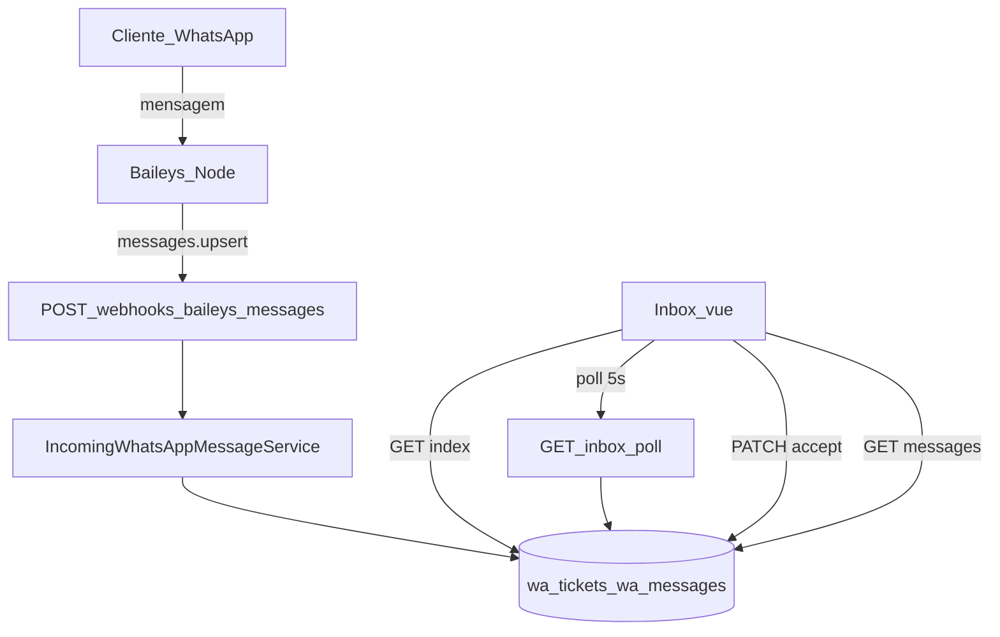
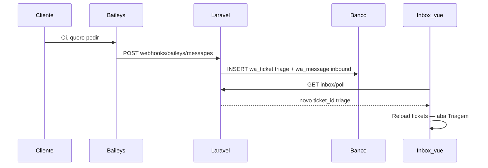
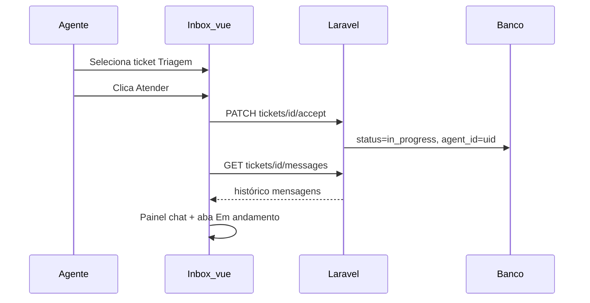

# Fluxo: Atendimentos WhatsApp (Inbox real)

> **Tipo:** spec de implementação para IA (não implementar neste chat — apenas seguir este documento em uma execução dedicada)  
> **Escopo:** integração completa **Baileys → banco → `/whatsapp/inbox`**: receber mensagens reais, criar tickets em **Triagem** no primeiro contato, botão **Atender** → **Em andamento** com painel de chat, remover dados hardcoded, polling de novidades.  
> **Pré-requisito:** [`docs/flow/WhatsApp/Conexoes.md`](Conexoes.md) (Fase 1) · [`docs/flow/WhatsApp/QrCode.md`](QrCode.md) (Baileys conectado)  
> **Depende de:** `docs/features/atendimento.md`, `docs/database/schema.md` (`wa_tickets`, `wa_messages`, `wa_connections`)  
> **Rotas:** `GET /whatsapp/inbox` · `GET /whatsapp/inbox/poll` · `GET /whatsapp/inbox/tickets/{ticket}/messages` · `PATCH /whatsapp/inbox/tickets/{ticket}/accept` · `POST /webhooks/baileys/messages`  
> **URL inbox:** `http://127.0.0.1:8000/whatsapp/inbox`  
> **Roles:** `admin|whatsapp_agent`

---

## Regra de produto (resumo)

| Ação | Resultado |
|------|-----------|
| Cliente envia 1ª mensagem no WhatsApp (número conectado) | Cria `wa_ticket` com `status = triage`; mensagem em `wa_messages`; aparece na aba **Triagem** com badge **Novo** |
| Cliente envia nova mensagem em ticket aberto (`triage` ou `in_progress`) | Append em `wa_messages`; atualiza preview e horário na lista |
| Cliente envia mensagem após ticket **Fechado** | Reabre fluxo: novo ticket em **Triagem** (mesmo telefone) |
| Agente clica **Atender** na Triagem | `status → in_progress`, `agent_id = usuário logado`; ticket move para **Em andamento**; abre chat no painel direito |
| Agente seleciona ticket **Em andamento** | Painel direito exibe histórico real de `wa_messages` |
| Mensagem chega com inbox aberta | Lista atualiza via **polling** (sem WebSocket nesta fase) |
| Dados mock no controller | **Removidos** — tudo vem do banco |

**Frase única:** toda mensagem inbound do WhatsApp sobe para a plataforma; o primeiro contato cai em Triagem; ao **Atender**, o ticket vira conversa ativa no painel de chat.

**Acesso:** `role:admin|whatsapp_agent` (rota já existente em `routes/web.php`).

---

## Objetivo

1. **Baileys:** escutar `messages.upsert` e encaminhar inbound para Laravel via webhook.
2. **Backend:** persistir mensagens em `wa_messages`; criar/atualizar `wa_tickets` com regras de triagem.
3. **Inbox:** substituir `InboxController::getTickets()` hardcoded por queries reais.
4. **Triagem:** botão **Atender** que assume ticket (`in_progress` + `agent_id`).
5. **Chat:** painel direito com mensagens reais do ticket selecionado.
6. **Polling:** detectar novos tickets/mensagens enquanto a inbox está aberta.

---

## Glossário

| Termo | Significado |
|-------|-------------|
| **Ticket** | Conversa com um cliente (`wa_tickets`); identificada por `phone_number` enquanto aberta |
| **Triagem** | `status = 'triage'` — aguardando agente clicar **Atender** |
| **Em andamento** | `status = 'in_progress'` — agente assumiu (`agent_id` preenchido) |
| **Primeiro contato** | Não existe ticket aberto (`triage` ou `in_progress`) para aquele telefone |
| **Inbound** | Mensagem recebida do cliente → `direction = 'inbound'` |
| **Outbound** | Mensagem enviada pelo agente → fora do escopo desta spec (Fase 4) |

---

## Estado atual do repositório (para a IA)

| Item | Status |
|------|--------|
| `GET /whatsapp/inbox` | Existe — `InboxController@index` |
| `InboxController::getTickets()` | **Hardcoded** — arrays estáticos |
| `Inbox.vue` | Layout dois painéis; lista + detalhe vazio |
| `WaContactRow.vue` | Linha de contato — sem botão Atender |
| `wa_tickets` / `wa_messages` migrations | **Existem** |
| Baileys `sessionManager.js` | Conexão/QR ok — **sem** `messages.upsert` |
| Webhook status | Existe — `POST /webhooks/baileys/status` |
| Webhook mensagens | **Não existe** |
| `accept` / `poll` / `messages` rotas | **Não existem** |
| `wa_connection_id` em tickets | **Não existe** — adicionar migration |

---

## Ordem de implementação (IA)

1. **Migration:** `wa_connection_id` nullable em `wa_tickets`.
2. **Baileys:** handler `messages.upsert` + webhook `POST /webhooks/baileys/messages`.
3. **Laravel:** `BaileysMessageWebhookController` + `IncomingWhatsAppMessageService`.
4. **Laravel:** refatorar `InboxController@index` — queries reais; remover `getTickets()` mock.
5. **Laravel:** `InboxController@poll`, `@messages`, `@accept`.
6. **Rotas:** registrar endpoints inbox + webhook mensagens.
7. **Frontend:** botão **Atender** (triagem); painel chat `WaChatPanel.vue`.
8. **Frontend:** polling na inbox (padrão `Orders.vue` / `pedidoCozinha.md`).
9. **Schema doc:** atualizar `docs/database/schema.md`.
10. **Testar** cenários da seção [Critérios de aceite](#critérios-de-aceite).

---

## Fluxo ponta a ponta



### Sequência — primeira mensagem



### Sequência — atender



---

## Regras de negócio — tickets e mensagens

### Criação / roteamento de ticket

| Situação | Ação |
|----------|------|
| Mensagem inbound de telefone **sem** ticket aberto (`triage` ou `in_progress`) | **Criar** ticket `status = triage`, `agent_id = null` |
| Mensagem inbound com ticket **triage** existente | **Reutilizar** ticket; append mensagem |
| Mensagem inbound com ticket **in_progress** existente | **Reutilizar** ticket; append mensagem |
| Mensagem inbound; último ticket **closed** | **Criar** novo ticket `status = triage` |
| Ticket **closed** | Não aceita append direto — nova mensagem gera novo ciclo em triagem |

### Identificação do telefone

- Normalizar JID Baileys → E.164 digits only para persistência (ex.: `5514999887766`).
- Exibição na UI: formatar com `+55` e máscara quando possível.
- Índice de busca: `wa_tickets.phone_number` (string consistente, sem `+` ou sempre com — **escolher um formato e manter**; recomendado: digits only no banco).

### Nome do cliente

- Primeira mensagem: usar `pushName` do Baileys se disponível → `customer_name`.
- Se ticket já tem nome, não sobrescrever com null; atualizar se pushName novo e campo vazio.

### Conexão WhatsApp

- Associar ticket a `wa_connection_id` da sessão que recebeu a mensagem.
- MVP: usar conexão `connected` ativa; se múltiplas, usar a sessão do evento.

### Tipos de mensagem (MVP)

| Tipo Baileys | Tratamento |
|--------------|------------|
| Texto (`conversation`, `extendedTextMessage`) | Persistir `body` |
| Imagem / áudio / documento | Persistir `body` = caption ou placeholder `[Imagem]`, `[Áudio]`, `[Documento]` |
| Grupo / status / broadcast | **Ignorar** — não criar ticket |

### Idempotência

- `wa_messages.wa_message_id` unique — duplicata do webhook retorna 200 sem reinsert.

---

## Backend — migration

**Arquivo:** `database/migrations/xxxx_add_wa_connection_id_to_wa_tickets_table.php`

```php
Schema::table('wa_tickets', function (Blueprint $table) {
    $table->foreignUuid('wa_connection_id')
        ->nullable()
        ->after('id')
        ->constrained('wa_connections')
        ->nullOnDelete();
});
```

**Índice composto sugerido** (migration separada ou mesma):

```php
$table->index(['phone_number', 'status']);
```

Documentar em `docs/database/schema.md`.

---

## Backend — Baileys `messages.upsert`

**Arquivo:** `services/baileys/src/sessionManager.js`

Dentro de `_startSocketBackground`, após `connection.update`:

```js
sock.ev.on('messages.upsert', async ({ messages, type }) => {
    if (type !== 'notify') return;

    for (const msg of messages) {
        if (msg.key.fromMe) continue;
        if (!msg.message) continue;

        const remoteJid = msg.key.remoteJid ?? '';
        if (remoteJid.endsWith('@g.us') || remoteJid === 'status@broadcast') continue;

        const phone = remoteJid.split('@')[0].replace(/\D/g, '');
        const body = extractTextBody(msg.message); // conversation | extendedTextMessage.text
        if (!body) continue;

        await notifyLaravelMessage({
            connection_id: id,
            wa_message_id: msg.key.id,
            phone_number: phone,
            customer_name: msg.pushName ?? null,
            body,
            sent_at: new Date(Number(msg.messageTimestamp) * 1000).toISOString(),
        });
    }
});
```

**Arquivo:** `services/baileys/src/webhook.js` — adicionar:

```js
export async function notifyLaravelMessage(payload) {
    await fetch(process.env.LARAVEL_WEBHOOK_MESSAGES_URL ?? 'http://127.0.0.1:8000/webhooks/baileys/messages', {
        method: 'POST',
        headers: {
            'Content-Type': 'application/json',
            'X-Baileys-Secret': process.env.BAILEYS_WEBHOOK_SECRET,
        },
        body: JSON.stringify(payload),
    });
}
```

**Env Baileys (`.env.example`):**

```env
LARAVEL_WEBHOOK_MESSAGES_URL=http://127.0.0.1:8000/webhooks/baileys/messages
```

---

## Backend — webhook mensagens

### Rota

```php
Route::post('/webhooks/baileys/messages', [BaileysMessageWebhookController::class, 'handle'])
    ->name('webhooks.baileys.messages');
```

Registrar em `routes/web.php` e `bootstrap/app.php` (CSRF except), junto ao webhook de status.

### Controller

**Arquivo:** `app/Http/Controllers/Webhooks/BaileysMessageWebhookController.php`

```php
public function handle(Request $request, IncomingWhatsAppMessageService $service)
{
    $secret = $request->header('X-Baileys-Secret');
    abort_unless($secret && hash_equals(config('services.baileys.webhook_secret'), $secret), 401);

    $validated = $request->validate([
        'connection_id'  => ['required', 'uuid'],
        'wa_message_id'  => ['required', 'string', 'max:128'],
        'phone_number'   => ['required', 'string', 'max:20'],
        'customer_name'  => ['nullable', 'string', 'max:120'],
        'body'           => ['required', 'string', 'max:5000'],
        'sent_at'        => ['nullable', 'date'],
    ]);

    $service->handleInbound($validated);

    return response()->json(['ok' => true]);
}
```

### Service

**Arquivo:** `app/Services/WhatsApp/IncomingWhatsAppMessageService.php`

```php
public function handleInbound(array $data): void
{
    DB::transaction(function () use ($data) {
        // 1. Idempotência
        if (DB::table('wa_messages')->where('wa_message_id', $data['wa_message_id'])->exists()) {
            return;
        }

        // 2. Ticket aberto?
        $openTicket = DB::table('wa_tickets')
            ->where('phone_number', $data['phone_number'])
            ->whereIn('status', ['triage', 'in_progress'])
            ->orderByDesc('updated_at')
            ->first();

        if ($openTicket) {
            $ticketId = $openTicket->id;
            if (empty($openTicket->customer_name) && ! empty($data['customer_name'])) {
                DB::table('wa_tickets')->where('id', $ticketId)->update([
                    'customer_name' => $data['customer_name'],
                ]);
            }
        } else {
            $ticketId = Str::uuid();
            DB::table('wa_tickets')->insert([
                'id'               => $ticketId,
                'wa_connection_id' => $data['connection_id'],
                'phone_number'     => $data['phone_number'],
                'customer_name'    => $data['customer_name'],
                'status'           => 'triage',
                'agent_id'         => null,
                'created_at'       => now(),
                'updated_at'       => now(),
            ]);
        }

        // 3. Mensagem
        DB::table('wa_messages')->insert([
            'id'            => Str::uuid(),
            'wa_ticket_id'  => $ticketId,
            'direction'     => 'inbound',
            'body'          => $data['body'],
            'wa_message_id' => $data['wa_message_id'],
            'sent_at'       => $data['sent_at'] ?? now(),
            'created_at'    => now(),
            'updated_at'    => now(),
        ]);

        // 4. Touch ticket
        DB::table('wa_tickets')->where('id', $ticketId)->update(['updated_at' => now()]);
    });
}
```

---

## Backend — `InboxController` (dados reais)

**Arquivo:** `app/Http/Controllers/WhatsApp/InboxController.php`

### Remover

- Método privado `getTickets()` com arrays estáticos **por completo**.

### `index`

Montar `tickets` agrupados por status — **mesmo shape** que o Vue já consome:

```php
private function buildTicketsGrouped(): array
{
  $rows = DB::table('wa_tickets as t')
    ->leftJoin(DB::raw('(
        SELECT wa_ticket_id, body, sent_at, created_at,
               ROW_NUMBER() OVER (PARTITION BY wa_ticket_id ORDER BY COALESCE(sent_at, created_at) DESC) as rn
        FROM wa_messages
    ) as lm'), function ($join) {
        $join->on('lm.wa_ticket_id', '=', 't.id')->where('lm.rn', '=', 1);
    })
    ->select([
        't.id', 't.customer_name', 't.phone_number', 't.status',
        't.agent_id', 't.updated_at',
        DB::raw('lm.body as last_message'),
    ])
    ->where(function ($q) {
        $q->whereIn('t.status', ['triage', 'in_progress'])
          ->orWhere(function ($q2) {
              $q2->where('t.status', 'closed')
                 ->whereDate('t.updated_at', today());
          });
    })
    ->get();

  // Agrupar + ordenar:
  // triage → created_at ASC (FIFO) — usar t.created_at na query
  // in_progress → updated_at DESC
  // closed → updated_at DESC (hoje)
}
```

**Alternativa MySQL 8 sem window function:** subquery correlacionada `last_message` (como em `atendimento.md`).

**Shape por ticket (contrato Vue):**

```php
[
    'id'            => 'uuid',
    'customer_name' => 'Maria Silva',
    'phone_number'  => '5511999887766',
    'last_message'  => 'Oi, quero fazer um pedido',
    'updated_at'    => '2026-05-24T12:00:00-03:00',
    'status'        => 'triage',        // novo — útil no frontend
    'agent_id'      => null,            // novo — opcional
]
```

Props Inertia:

```php
return Inertia::render('WhatsApp/Inbox', [
    'tickets'   => $this->buildTicketsGrouped(),
    'date'      => now()->format('d/m/Y'),
    'authUserId'=> auth()->id(),
]);
```

### `poll`

| Item | Valor |
|------|-------|
| Método / URI | `GET /whatsapp/inbox/poll` |
| Auth | `role:admin|whatsapp_agent` |
| Resposta | JSON |

```json
{
  "triage_ids": ["uuid-1", "uuid-2"],
  "in_progress_ids": ["uuid-3"],
  "updated_at_max": "2026-05-24T12:05:00-03:00",
  "server_time": "2026-05-24T12:05:01-03:00"
}
```

**Uso no frontend:** comparar com snapshot anterior; se mudou → `router.reload({ only: ['tickets'], preserveScroll: true })`. Se ticket aberto no chat mudou → refetch messages.

Query sugerida:

```php
'triage_ids' => DB::table('wa_tickets')->where('status', 'triage')->orderBy('created_at')->pluck('id'),
'in_progress_ids' => DB::table('wa_tickets')->where('status', 'in_progress')->orderByDesc('updated_at')->pluck('id'),
'updated_at_max' => DB::table('wa_tickets')->max('updated_at'),
```

### `messages`

| Item | Valor |
|------|-------|
| Método / URI | `GET /whatsapp/inbox/tickets/{ticket}/messages` |
| Resposta | JSON array ordenado ASC |

```json
{
  "ticket": {
    "id": "uuid",
    "customer_name": "Ana",
    "phone_number": "5511977665544",
    "status": "in_progress"
  },
  "messages": [
    {
      "id": "uuid",
      "direction": "inbound",
      "body": "Oi, quero pedir",
      "sent_at": "2026-05-24T11:58:00-03:00"
    }
  ]
}
```

Ordenação: `ORDER BY COALESCE(sent_at, created_at) ASC`.

### `accept` (Atender)

| Item | Valor |
|------|-------|
| Método / URI | `PATCH /whatsapp/inbox/tickets/{ticket}/accept` |
| Auth | `role:admin|whatsapp_agent` |
| Resposta | JSON `{ "ok": true, "status": "in_progress" }` ou redirect Inertia |

**Validação:**

| Regra | Erro |
|-------|------|
| Ticket existe | 404 |
| `status === 'triage'` | 422 `"Ticket não está em triagem"` |
| Usuário autenticado | 401 |

**Update:**

```php
DB::table('wa_tickets')->where('id', $ticketId)->update([
    'status'     => 'in_progress',
    'agent_id'   => auth()->id(),
    'updated_at' => now(),
]);
```

---

## Backend — rotas inbox

Dentro do grupo `role:admin|whatsapp_agent` + prefix `whatsapp`:

```php
Route::get('/inbox', [InboxController::class, 'index'])->name('inbox');
Route::get('/inbox/poll', [InboxController::class, 'poll'])->name('inbox.poll');
Route::get('/inbox/tickets/{ticket}/messages', [InboxController::class, 'messages'])->name('inbox.messages');
Route::patch('/inbox/tickets/{ticket}/accept', [InboxController::class, 'accept'])->name('inbox.accept');
```

---

## UI — inbox (`Inbox.vue`)

### Layout (manter estrutura atual)

```
┌──────────────┬────────────────────────────────────────┐
│ Lista 380px  │  Painel direito — chat / triagem       │
│ abas+busca   │                                        │
│ contatos     │                                        │
└──────────────┴────────────────────────────────────────┘
```

### Estados do painel direito

| Condição | Conteúdo |
|----------|----------|
| Nenhum selecionado | Empty state atual — *"Selecione um ticket para iniciar o atendimento"* |
| Ticket **triage** selecionado | Cabeçalho contato + preview última mensagem + botão primário **Atender** |
| Ticket **in_progress** selecionado | `WaChatPanel` — bolhas inbound alinhadas |
| Ticket **closed** selecionado | Chat read-only (histórico do dia) |

### Botão **Atender**

| Item | Especificação |
|------|---------------|
| Onde | Painel direito quando ticket triagem selecionado; **opcional** botão compacto na linha (`WaContactRow`) na aba Triagem |
| Label | `Atender` |
| Estilo | Primário `#378ADD`, fundo sólido, texto branco |
| Ação | `PATCH .../accept` → em sucesso: `activeTab = 'in_progress'`, carregar messages, manter seleção |
| Loading | Desabilitar botão durante request |
| Erro 422 | Toast/mensagem inline |

### Polling

```js
const POLL_MS = 5000;
let pollTimer = null;
let lastSnapshot = null;

async function pollInbox() {
  if (document.visibilityState !== 'visible') return;
  const { data } = await axios.get('/whatsapp/inbox/poll');
  const snapshot = JSON.stringify(data);
  if (lastSnapshot && snapshot !== lastSnapshot) {
    router.reload({ only: ['tickets'], preserveScroll: true });
    if (selectedId.value) fetchMessages(selectedId.value);
  }
  lastSnapshot = snapshot;
}

onMounted(() => { pollTimer = setInterval(pollInbox, POLL_MS); });
onUnmounted(() => clearInterval(pollTimer));
```

Pausar poll com aba em background (`visibilitychange`).

### Seleção de ticket

- Ao clicar linha: `selectedId = ticket.id`; se `in_progress` ou `closed` → fetch messages; se `triage` → mostrar painel Atender (sem fetch obrigatório).

---

## UI — `WaChatPanel.vue`

**Arquivo:** `resources/js/Components/WaChatPanel.vue`  
**CSS:** `resources/js/Components/styles/WaChatPanel.css`

### Props

```js
defineProps({
  ticket: { type: Object, required: true },
  messages: { type: Array, default: () => [] },
  loading: { type: Boolean, default: false },
});
```

### Layout ASCII

```
┌─────────────────────────────────────────┐
│  (MS)  Maria Silva                      │
│        +55 11 99988-7766                │
├─────────────────────────────────────────┤
│                                         │
│  ┌──────────────────────┐               │
│  │ Oi, quero pedir       │  11:58       │
│  └──────────────────────┘               │
│                                         │
│        ┌──────────────────────┐       │
│        │ Resposta futura       │       │
│        └──────────────────────┘       │
│                                         │
└─────────────────────────────────────────┘
```

### Bolhas

| `direction` | Alinhamento | Cor |
|-------------|-------------|-----|
| `inbound` | Esquerda | Fundo `#E6F1FB`, texto `#17181e` |
| `outbound` | Direita (Fase 4) | Fundo `#378ADD`, texto branco |

Horário abaixo ou dentro da bolha — `HH:mm` de `sent_at`.

### Scroll

- Container com `overflow-y: auto`; ao carregar mensagens, scroll para o final.

---

## UI — `WaContactRow.vue` (alterações)

### Botão Atender inline (opcional, recomendado na aba Triagem)

Quando `showAtenderButton === true` (`activeTab === 'triage'`):

- Pequeno botão **Atender** à direita da linha ( `@click.stop` para não conflitar com select).
- Emite `@accept` com `ticket.id`.

Se não implementar inline, **obrigatório** no painel direito.

---

## Queries — `last_message`

Subquery compatível MySQL (sem window functions):

```sql
SELECT t.*, (
  SELECT m.body FROM wa_messages m
  WHERE m.wa_ticket_id = t.id
  ORDER BY COALESCE(m.sent_at, m.created_at) DESC
  LIMIT 1
) AS last_message
FROM wa_tickets t
WHERE ...
```

Truncar preview no PHP ou Vue (~60 chars + ellipsis).

---

## Fora de escopo (esta spec)

- Envio de mensagens outbound pelo agente (Fase 4 — `POST .../messages` + Baileys send)
- Encerrar ticket (`closed`) — botão fechar conversa
- Registrar pedido a partir do chat
- Laravel Echo / WebSocket
- Notificação sonora na inbox (opcional futuro)
- Anexos mídia completos (download/exibir imagem)
- Atribuição multi-agente / filas por departamento
- Vincular ticket a mesa/pedido

---

## Mapa de arquivos

| Arquivo | Ação |
|---------|------|
| `docs/flow/WhatsApp/Atendimentos.md` | Este documento |
| `docs/database/schema.md` | **Alterar** — `wa_connection_id` em tickets |
| `database/migrations/*_add_wa_connection_id_to_wa_tickets.php` | **Adicionar** |
| `services/baileys/src/sessionManager.js` | **Alterar** — `messages.upsert` |
| `services/baileys/src/webhook.js` | **Alterar** — `notifyLaravelMessage` |
| `services/baileys/.env.example` | **Alterar** — URL webhook mensagens |
| `app/Services/WhatsApp/IncomingWhatsAppMessageService.php` | **Adicionar** |
| `app/Http/Controllers/Webhooks/BaileysMessageWebhookController.php` | **Adicionar** |
| `app/Http/Controllers/WhatsApp/InboxController.php` | **Alterar** — real data, poll, messages, accept |
| `routes/web.php` | **Alterar** — rotas poll/messages/accept + webhook |
| `bootstrap/app.php` | **Alterar** — CSRF except webhook messages |
| `resources/js/Pages/WhatsApp/Inbox.vue` | **Alterar** — chat, atender, polling |
| `resources/js/Components/WaChatPanel.vue` | **Adicionar** |
| `resources/js/Components/styles/WaChatPanel.css` | **Adicionar** |
| `resources/js/Components/WaContactRow.vue` | **Alterar** — botão Atender opcional |
| `docs/flow/WhatsApp/QrCode.md` | **Alterar** nota — mensagens saem do "Fase 3" para este doc |

**Remover:** arrays estáticos em `InboxController::getTickets()`.

---

## Critérios de aceite

- [ ] Mensagem WhatsApp inbound (Baileys conectado) cria ticket em **Triagem** no primeiro contato
- [ ] Ticket aparece em `/whatsapp/inbox` aba **Triagem** com badge **Novo** e preview da mensagem
- [ ] Segunda mensagem do mesmo cliente (ticket aberto) append em `wa_messages` sem duplicar ticket
- [ ] **Atender** move ticket para **Em andamento** e preenche `agent_id`
- [ ] Painel direito exibe histórico real de mensagens após atender
- [ ] `InboxController` **não** contém dados hardcoded
- [ ] Webhook mensagens valida `X-Baileys-Secret`; duplicata `wa_message_id` ignorada
- [ ] Polling atualiza lista quando chega mensagem nova (inbox aberta)
- [ ] Mensagem após ticket fechado cria novo ticket em triagem
- [ ] Grupos e status broadcast ignorados
- [ ] Admin e `whatsapp_agent` acessam inbox; outros roles → 403

---

## Cenários de teste manual

| # | Passos | Resultado esperado |
|---|--------|-------------------|
| 1 | WhatsApp conectado; enviar msg de número novo | Ticket em Triagem; preview correto |
| 2 | Enviar 2ª msg mesmo número (ainda triagem) | 1 ticket; 2 linhas em `wa_messages` |
| 3 | Selecionar ticket triagem → **Atender** | Move para Em andamento; chat visível |
| 4 | Enviar msg com ticket in_progress | Chat atualiza (poll ou refetch) |
| 5 | Recarregar página com ticket selecionado | Histórico persiste do banco |
| 6 | Inbox aberta; msg externa | Lista atualiza em ≤5s |
| 7 | Webhook replay mesma `wa_message_id` | Sem duplicata |
| 8 | Mensagem de grupo | Ignorada |
| 9 | Login admin → `/whatsapp/inbox` | Funciona (não só agent) |
| 10 | Fechar ticket manual no banco (`closed`) + nova msg | Novo ticket triagem |

---

## Referências cruzadas

| Documento | Relação |
|-----------|---------|
| [`docs/flow/WhatsApp/Conexoes.md`](Conexoes.md) | Canais WhatsApp |
| [`docs/flow/WhatsApp/QrCode.md`](QrCode.md) | Baileys conectado — pré-requisito |
| `docs/features/atendimento.md` | Layout inbox MVP (mock) |
| `docs/database/schema.md` | `wa_tickets`, `wa_messages` |
| `docs/flow/tablets/pedidoCozinha.md` | Padrão polling (`OrdersController@poll`) |

---

## Fase 4 — preview (não implementar nesta spec)

| Entrega | Descrição |
|---------|-----------|
| Enviar resposta | `POST /whatsapp/inbox/tickets/{ticket}/messages` + Baileys `sendMessage` |
| Encerrar ticket | `PATCH .../close` → `status = closed` |
| Som novo ticket triagem | Toggle na toolbar inbox |
| Mídia | Download/exibir imagens inbound |

Documento futuro sugerido: `docs/flow/WhatsApp/Respostas.md`
