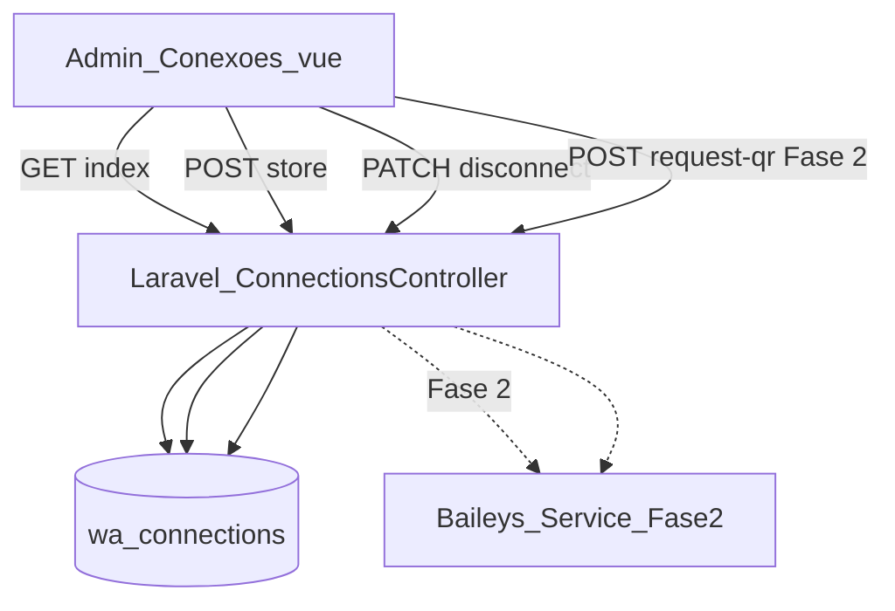
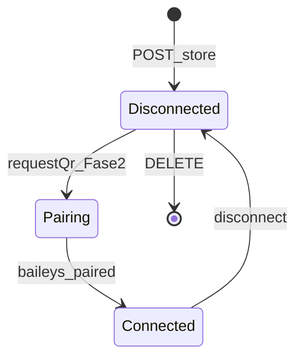

# Fluxo: Conexões WhatsApp (Admin)

> **Tipo:** spec de implementação para IA (não implementar neste chat — apenas seguir este documento em uma execução dedicada)  
> **Escopo:** Fase 1 — tela admin de conexões, cadastro de canal, cards de status (conectado/desconectado), desconectar (stub Baileys). **QR Code e sessão Baileys na Fase 2.**  
> **Pré-requisito:** auth Firebase + `role:admin`; módulo WhatsApp inbox (`docs/features/atendimento.md`)  
> **Depende de:** `docs/features/atendimento.md`, `docs/database/schema.md` (nova tabela `wa_connections`)  
> **API de atendimento:** [Baileys](https://github.com/WhiskeySockets/Baileys) (API não oficial) — serviço Node separado; Laravel orquestra via HTTP interno  
> **Rotas:** `GET /admin/whatsapp/conexoes` · `POST /admin/whatsapp/conexoes` · `PATCH /admin/whatsapp/conexoes/{connection}/disconnect` · `DELETE /admin/whatsapp/conexoes/{connection}` · `POST /admin/whatsapp/conexoes/{connection}/request-qr` (Fase 2)  
> **URL admin:** `http://127.0.0.1:8000/admin/whatsapp/conexoes`

---

## Regra de produto (resumo)

| Ação | Resultado |
|------|-----------|
| Admin abre **Conexões** | Toolbar com botão **Adicionar** no canto superior direito; sem conexões cadastradas = **nenhum card** na área de conteúdo |
| Admin clica **Adicionar** | Modal central (`admin-modal`) com **Tipo de canal** (select com seta) e **Nome** |
| Admin clica **Salvar** | Conexão persistida; card aparece com nome, logo WhatsApp e status **Desconectado** |
| Card **Conectado** | Título `CONECTADO`, descrição *Conexão estabelecida*, timestamp *Última atualização*, botão **Desconectar** (outline vermelho) |
| Card **Desconectado** | Título `DESCONECTADO`, botão **Solicitar QR Code** (ação real na Fase 2) |
| Admin clica **Desconectar** | Status → `disconnected`; serviço Baileys encerra sessão (Fase 2) |
| `whatsapp_agent` ou outros roles | **403** — rota inacessível |

**Frase única:** o admin configura os canais WhatsApp do restaurante em uma tela exclusiva; cada canal vira um card de status; o pareamento via QR Code entra na Fase 2 com Baileys.

**Acesso:** apenas `role:admin` (mesmo padrão das rotas `/admin/*` em `routes/web.php`). A inbox de atendimento (`/whatsapp/inbox`) continua acessível a `admin|whatsapp_agent`.

---

## Objetivo

1. **Tela admin:** página `/admin/whatsapp/conexoes` com layout branco consistente com o restante do site.
2. **Cadastro:** modal para criar conexão com tipo de canal (WhatsApp) e nome.
3. **Cards:** exibir conexões existentes no layout da referência visual (header com logo + nome + telefone, corpo com status, footer com ação).
4. **Estados:** distinguir **Conectado** e **Desconectado** com textos, ícones e botões distintos.
5. **Backend:** persistir conexões em `wa_connections`; stub do cliente Baileys até a Fase 2.

---

## Glossário

| Termo | Significado |
|-------|-------------|
| **Conexão / canal** | Registro em `wa_connections` representando uma instância WhatsApp (ex.: "Comercial 2") |
| **Baileys** | Biblioteca Node.js não oficial (`@whiskeysockets/baileys`); roda em processo/serviço à parte do Laravel |
| **Conectado** | `connection_status = 'connected'` — sessão WhatsApp ativa no Baileys |
| **Desconectado** | `connection_status = 'disconnected'` — sem sessão; aguardando pareamento |
| **Pairing** | `connection_status = 'pairing'` — QR Code gerado, aguardando scan (Fase 2) |
| **Fase 1** | UI + CRUD + stubs; status inicia sempre `disconnected` |
| **Fase 2** | Serviço Baileys real, QR Code, telefone, polling/webhook de status |

---

## Estado atual do repositório (para a IA)

| Item | Status |
|------|--------|
| `docs/flow/WhatsApp/Conexoes.md` | **Este documento** |
| Tabela `wa_connections` | **Não existe** |
| Rota `/admin/whatsapp/conexoes` | **Não existe** |
| Baileys / serviço Node | **Não existe** |
| Inbox mock | Existe — `WhatsApp\InboxController` com dados estáticos |
| Modal padrão `admin-modal` | Existe — `UserCreatePanel.vue`, `AdminModal.css` |
| Select com seta (floating label) | Existe — `DepartmentSelect.vue`, `DishCategorySelect.vue` |
| Sidebar WhatsApp | Item **Atendimento** → `/whatsapp/inbox`; **sem** link Conexões |

---

## Ordem de implementação (IA)

1. **Migration:** `wa_connections`.
2. **Backend:** `ConnectionsController` (index, store, disconnect, destroy, requestQr stub).
3. **Backend:** `BaileysClient` stub em `App\Services\WhatsApp\`.
4. **Rotas:** registrar em `routes/web.php` dentro de `role:admin` + prefix `admin/whatsapp`.
5. **Frontend:** `Pages/Admin/WhatsApp/Conexoes.vue` + CSS externo.
6. **Componentes:** `WaConnectionCard.vue`, `WaConnectionCreatePanel.vue`, `WaChannelTypeSelect.vue`.
7. **Sidebar:** link **Conexões** visível **somente** para `role:admin`.
8. **Schema doc:** adicionar seção `wa_connections` em `docs/database/schema.md`.
9. **Testar** cenários da seção [Critérios de aceite](#critérios-de-aceite).

---

## Fluxo ponta a ponta



### Diagrama de estados do card



---

## Gatilho — admin

1. Admin autenticado acessa `/admin/whatsapp/conexoes`.
2. Se **nenhuma conexão** cadastrada: página exibe apenas toolbar (título + botão **Adicionar**); **não** renderiza cards.
3. Admin clica **Adicionar** → modal central abre.
4. Preenche **Tipo de canal** (`WhatsApp`) e **Nome** → clica **Salvar**.
5. Backend persiste registro com `connection_status = 'disconnected'`.
6. Card aparece na grid com logo WhatsApp, nome e status **DESCONECTADO**.
7. Admin clica **Solicitar QR Code** → Fase 2 (Fase 1: stub ou toast informativo).
8. Após pareamento (Fase 2): card passa a **CONECTADO**, exibe telefone, descrição e botão **Desconectar**.
9. Admin clica **Desconectar** → status `disconnected`; botão **Solicitar QR Code** volta a aparecer.

---

## UI — layout da página

### Shell

- Reutilizar `AppSidebar.vue` com `active="whatsapp-conexoes"` (ou chave equivalente).
- Área principal: fundo branco (`#ffffff`), padding consistente com outras páginas admin (`Users.vue`, `Dishes.vue`).
- **Não** usar tema escuro da referência visual — adaptar layout para **tema claro** do site.

### Toolbar

```
┌─────────────────────────────────────────────────────────────────┐
│  Conexões WhatsApp                              [ + Adicionar ]  │
│  Gerencie os canais de atendimento WhatsApp                     │
└─────────────────────────────────────────────────────────────────┘
```

| Elemento | Especificação |
|----------|---------------|
| Título | `Conexões WhatsApp` — `#111827`, bold |
| Subtítulo | `Gerencie os canais de atendimento WhatsApp` — `#6b7280`, opcional |
| Botão **Adicionar** | Canto superior direito; estilo primário admin (ex.: fundo `#993C1D` ou padrão do site); ícone `+` opcional |

### Área de conteúdo — grid de cards

- **Sem conexões:** área vazia abaixo da toolbar — **nenhum card**, **nenhuma** mensagem placeholder obrigatória.
- **Com conexões:** grid responsivo:

```css
display: grid;
grid-template-columns: repeat(auto-fill, minmax(320px, 1fr));
gap: 16px;
```

Suporta **múltiplas conexões** (ex.: Comercial 1, Comercial 2).

---

## UI — card de conexão (`WaConnectionCard.vue`)

Adaptar layout da referência visual para **tema claro**.

### Estrutura ASCII

```
┌─────────────────────────────────────────────┐
│ [WA]  Comercial 2                      [ ⋮ ]│
│       +55 14 98170-6236                     │
├─────────────────────────────────────────────┤
│ [📶]  CONECTADO                             │
│       Conexão estabelecida                  │
│       Última atualização: 24/05/2026 05:13  │
├─────────────────────────────────────────────┤
│            [ Desconectar ]                  │
└─────────────────────────────────────────────┘
```

### Estilo geral do card

| Propriedade | Valor |
|-------------|-------|
| Fundo | `#ffffff` |
| Borda | `1px solid #e5e7eb` |
| Border-radius | `8px` ou `12px` (consistente com cards admin) |
| Sombra | `0 1px 3px rgba(0,0,0,0.08)` |
| CSS | Externo — `resources/js/Components/styles/WaConnectionCard.css` |

### Seção header (borda inferior `1px solid #e5e7eb`)

| Elemento | Fonte / regra |
|----------|---------------|
| Logo WhatsApp | Círculo `#25D366`, ícone branco — SVG inline |
| Nome | `connection.name` — `font-weight: 600`, `#111827` |
| Telefone | `connection.phone_number` formatado E.164 legível — `#6b7280`, `font-size` menor |
| Telefone se `null` | Ocultar linha ou exibir `—` (Fase 1: sempre oculto/desconectado) |
| Menu **⋮** (kebab) | Canto direito; ações: **Excluir** (com confirmação). **Editar nome** — fora do escopo Fase 1 |

Formato telefone sugerido: `+55 14 98170-6236` (máscara client-side a partir de E.164).

### Seção corpo (status)

| `connection_status` | Ícone | Título | Descrição |
|---------------------|-------|--------|-----------|
| `connected` | Sinal verde (wifi + setas up/down) | **CONECTADO** | Conexão estabelecida |
| `disconnected` | Sinal cinza | **DESCONECTADO** | Aguardando pareamento |
| `pairing` | Sinal amarelo/laranja (Fase 2) | **PAREAMENTO** | Escaneie o QR Code |

| Elemento | Regra |
|----------|-------|
| Título status | ALL CAPS, bold, `#111827` |
| Descrição | `#6b7280`, regular |
| Timestamp | `Última atualização: DD/MM/YYYY HH:mm` — label `#6b7280`, data/hora `#111827` |
| Fonte timestamp | `last_status_at` ?? `updated_at` |

Timezone: `config('app.timezone')` (padrão `America/Sao_Paulo`).

### Seção footer (borda superior `1px solid #e5e7eb`)

| Status | Botão | Estilo |
|--------|-------|--------|
| `connected` | **Desconectar** | Outline vermelho: `border: 1px solid #dc2626`, texto `#dc2626`, fundo transparente, hover `#fef2f2` |
| `disconnected` | **Solicitar QR Code** | Outline primário: `border: 1px solid #378ADD`, texto `#378ADD` |
| `pairing` | **Cancelar pareamento** (Fase 2) | Outline secundário |

Botão centralizado na footer; largura `100%` ou `auto` com padding horizontal generoso.

**Regra:** card **só renderiza** se existir ao menos 1 conexão cadastrada (controlado pelo pai — loop em `connections`).

---

## UI — modal Adicionar conexão (`WaConnectionCreatePanel.vue`)

### Gatilho

Admin clica **Adicionar** na toolbar → `isCreateOpen = true`.

### Shell modal

Reutilizar padrão existente:

- Overlay: `admin-modal-overlay` — clique fora fecha e descarta
- Container: `section.admin-modal` centralizado — `role="dialog"`, `aria-modal="true"`
- Header: `admin-modal-head` — título `Nova conexão`
- Form: `admin-modal-form` com campos em `admin-modal-field`
- Footer: `admin-modal-actions` — **Sair** (`secondary`) + **Salvar** (`primary`)

CSS base: `AdminModal.css`. Estilos específicos: `WaConnectionCreatePanel.css`.

### Campos

| Campo | Componente | Regras |
|-------|------------|--------|
| **Tipo de canal** | `WaChannelTypeSelect.vue` (padrão `DepartmentSelect` / `DishCategorySelect`) | Floating label `Tipo de canal`; seta dropdown; opções fixas: `{ value: 'whatsapp', label: 'WhatsApp' }`. Default: `whatsapp`. Select **somente leitura** na prática (uma opção) — manter extensível |
| **Nome** | Input texto com floating label | Label `Nome`; obrigatório; 2–80 chars; trim |

### Ações

| Botão | Comportamento |
|-------|---------------|
| **Sair** | Fecha modal; limpa form; limpa erros |
| **Salvar** | `POST /admin/whatsapp/conexoes`; loading no botão; erros inline (`admin-modal-error`) |
| Overlay / Esc | Igual **Sair** |

### Após salvar com sucesso

- Fechar modal.
- Flash: `Conexão criada com sucesso.`
- Card novo aparece na grid com status **DESCONECTADO**.

---

## UI — sidebar e navegação

| Perfil | Itens visíveis |
|--------|----------------|
| `admin` | **Conexões** → `/admin/whatsapp/conexoes` **e** **Atendimento** → `/whatsapp/inbox` |
| `whatsapp_agent` | Apenas **Atendimento** → `/whatsapp/inbox` — **sem** link Conexões |

Implementação sugerida:

- Passar `auth.user.role` via `HandleInertiaRequests` (se ainda não disponível).
- Em `AppSidebar.vue`, renderizar item Conexões condicionalmente:

```js
{ key: 'whatsapp-conexoes', label: 'Conexoes', icon: 'settings', route: '/admin/whatsapp/conexoes', adminOnly: true }
```

Filtrar `items` onde `adminOnly && userRole !== 'admin'`.

---

## Backend — migration `wa_connections`

**Arquivo:** `database/migrations/xxxx_xx_xx_create_wa_connections_table.php`

```php
Schema::create('wa_connections', function (Blueprint $table) {
    $table->uuid('id')->primary();
    $table->string('name');
    $table->string('channel_type')->default('whatsapp'); // whatsapp
    $table->string('phone_number')->nullable();          // E.164 após pareamento Baileys
    $table->string('connection_status')->default('disconnected'); // connected|disconnected|pairing
    $table->timestamp('last_status_at')->nullable();
    $table->string('baileys_session_id')->nullable();    // Fase 2 — ID da sessão no serviço Node
    $table->timestamps();
});
```

**Índices / constraints:**

| Item | Regra |
|------|-------|
| `name` | `unique()` — evita duplicata no MVP single-tenant |
| `connection_status` | Valores válidos validados no controller |
| `channel_type` | Valores válidos: `whatsapp` (extensível) |

**Documentar** em `docs/database/schema.md` após criar migration.

---

## Backend — rotas

Registrar em `routes/web.php` dentro do grupo existente `role:admin`:

```php
Route::prefix('whatsapp')->name('whatsapp.')->group(function () {
  Route::get('/conexoes', [ConnectionsController::class, 'index'])->name('conexoes.index');
  Route::post('/conexoes', [ConnectionsController::class, 'store'])->name('conexoes.store');
  Route::patch('/conexoes/{connection}/disconnect', [ConnectionsController::class, 'disconnect'])->name('conexoes.disconnect');
  Route::delete('/conexoes/{connection}', [ConnectionsController::class, 'destroy'])->name('conexoes.destroy');
  Route::post('/conexoes/{connection}/request-qr', [ConnectionsController::class, 'requestQr'])->name('conexoes.requestQr');
});
```

URL completa: `/admin/whatsapp/conexoes` (prefix `admin` do grupo pai).

**Auth:** `firebase.auth` → `force.password.reset` → `role:admin`.

---

## Backend — `ConnectionsController`

**Arquivo:** `app/Http/Controllers/Admin/WhatsApp/ConnectionsController.php`

### `index`

| Item | Valor |
|------|-------|
| Método / URI | `GET /admin/whatsapp/conexoes` |
| Resposta | Inertia `Admin/WhatsApp/Conexoes` |

```php
return Inertia::render('Admin/WhatsApp/Conexoes', [
    'connections' => DB::table('wa_connections')
        ->orderBy('created_at', 'asc')
        ->get()
        ->map(fn ($row) => [
            'id' => $row->id,
            'name' => $row->name,
            'channel_type' => $row->channel_type,
            'phone_number' => $row->phone_number,
            'connection_status' => $row->connection_status,
            'last_status_at' => $row->last_status_at,
            'updated_at' => $row->updated_at,
        ]),
]);
```

### `store`

| Item | Valor |
|------|-------|
| Método / URI | `POST /admin/whatsapp/conexoes` |
| Resposta sucesso | `redirect()->route('admin.whatsapp.conexoes.index')->with('success', 'Conexão criada com sucesso.')` |

**Body (Inertia form ou JSON):**

```json
{
  "name": "Comercial 2",
  "channel_type": "whatsapp"
}
```

**Validação:**

| Campo | Regra | Erro |
|-------|--------|------|
| `name` | Obrigatório, string, min 2, max 80, trim | 422 |
| `name` | Único em `wa_connections.name` | 422 `"Já existe uma conexão com este nome"` |
| `channel_type` | Obrigatório, `in:whatsapp` | 422 |

**Insert:**

```php
DB::table('wa_connections')->insert([
    'id' => Str::uuid(),
    'name' => $validated['name'],
    'channel_type' => $validated['channel_type'],
    'connection_status' => 'disconnected',
    'last_status_at' => now(),
    'created_at' => now(),
    'updated_at' => now(),
]);
```

### `disconnect`

| Item | Valor |
|------|-------|
| Método / URI | `PATCH /admin/whatsapp/conexoes/{connection}/disconnect` |
| `{connection}` | UUID da conexão |

```php
// 1. Buscar registro; 404 se não existir
// 2. Fase 2: BaileysClient::disconnect($connection->baileys_session_id)
// 3. Atualizar banco:
DB::table('wa_connections')->where('id', $id)->update([
    'connection_status' => 'disconnected',
    'phone_number' => null,           // opcional — limpar ao desconectar
    'last_status_at' => now(),
    'updated_at' => now(),
]);
return redirect()->back()->with('success', 'Conexão desconectada.');
```

**Fase 1:** passo 2 é no-op no stub `BaileysClient`.

### `destroy`

| Item | Valor |
|------|-------|
| Método / URI | `DELETE /admin/whatsapp/conexoes/{connection}` |

```php
// Fase 2: encerrar sessão Baileys se existir
DB::table('wa_connections')->where('id', $id)->delete();
return redirect()->back()->with('success', 'Conexão removida.');
```

Confirmação no frontend antes de chamar DELETE (dialog nativo ou modal leve).

### `requestQr` (Fase 2 — stub na Fase 1)

| Item | Valor |
|------|-------|
| Método / URI | `POST /admin/whatsapp/conexoes/{connection}/request-qr` |

**Fase 1:** retornar `501` JSON `{ "message": "QR Code disponível na Fase 2" }` **ou** redirect back com flash info. Frontend exibe toast: *"Pareamento via QR Code será habilitado em breve."*

**Fase 2 (documentar, não implementar agora):**

```php
// BaileysClient::requestQr($sessionId) → { qr_base64, expires_at }
// Atualizar connection_status = 'pairing'
// Retornar QR para modal ou SSE
```

---

## Backend — `BaileysClient` (stub Fase 1)

**Arquivo:** `app/Services/WhatsApp/BaileysClient.php`

**Env:** `BAILEYS_SERVICE_URL` (ex.: `http://127.0.0.1:3001`)

| Método | Fase 1 | Fase 2 |
|--------|--------|--------|
| `createSession(string $connectionId)` | Retorna `['session_id' => $connectionId]` | POST `{BAILEYS}/sessions` |
| `requestQr(string $sessionId)` | Lança exceção ou retorna null | POST `{BAILEYS}/sessions/{id}/qr` |
| `disconnect(string $sessionId)` | No-op | POST `{BAILEYS}/sessions/{id}/disconnect` |
| `getStatus(string $sessionId)` | Retorna `'disconnected'` | GET `{BAILEYS}/sessions/{id}/status` |

Injetar via constructor; usar `Http::timeout(5)` do Laravel.

---

## Integração Baileys — visão Fase 2 (referência)

Serviço Node separado (`services/baileys/` ou repo à parte):

```
POST   /sessions              → cria sessão
POST   /sessions/:id/qr       → gera QR (base64)
POST   /sessions/:id/disconnect
GET    /sessions/:id/status   → connected|disconnected|pairing
POST   /webhook/status        → callback para Laravel atualizar wa_connections
```

Laravel recebe webhook e atualiza:

- `connection_status`
- `phone_number` (E.164)
- `last_status_at`

**Nota arquitetural:** esta escolha (Baileys) substitui Z-API/WABA **para o módulo de atendimento deste projeto**. `docs/project_overview.md` pode ser atualizado em tarefa separada.

---

## Frontend — `Conexoes.vue`

**Arquivo:** `resources/js/Pages/Admin/WhatsApp/Conexoes.vue`

### Props Inertia

```js
defineProps({
  connections: { type: Array, default: () => [] },
});
```

### Estado local

```js
const isCreateOpen = ref(false);
const pendingDeleteConnection = ref(null);
```

### Handlers

| Evento | Ação |
|--------|------|
| `@add` / botão Adicionar | `isCreateOpen = true` |
| `@disconnect` no card | `router.patch(\`/admin/whatsapp/conexoes/${id}/disconnect\`)` |
| `@request-qr` no card | `router.post(...)` ou toast stub Fase 1 |
| `@delete` no card | confirma → `router.delete(...)` |
| Flash success | Banner/toast no topo (padrão admin) |

### Template (estrutura)

```html
<AppSidebar active="whatsapp-conexoes" />
<main>
  <header><!-- título + Adicionar --></header>
  <div v-if="connections.length" class="connections-grid">
    <WaConnectionCard
      v-for="c in connections"
      :key="c.id"
      :connection="c"
      @disconnect="..."
      @request-qr="..."
      @delete="..."
    />
  </motion>
  <WaConnectionCreatePanel
    v-if="isCreateOpen"
    @close="isCreateOpen = false"
  />
</main>
```

CSS: `Pages/Admin/WhatsApp/styles/Conexoes.css`.

---

## Regras de negócio

| Regra | Detalhe |
|-------|---------|
| Acesso | Somente `role:admin` |
| Cards vazios | Se `connections.length === 0`, não renderizar grid |
| Nome único | Backend valida unique em `wa_connections.name` |
| Status inicial | Toda conexão nova nasce `disconnected` |
| Telefone | Só preenchido após pareamento Baileys (Fase 2) |
| Desconectar | Só visível quando `connection_status === 'connected'` |
| Solicitar QR | Só visível quando `disconnected` (e `pairing` na Fase 2) |
| Excluir | Remove registro; encerra sessão Baileys se ativa (Fase 2) |
| Múltiplas conexões | Permitido — uma por card na grid |

---

## Fora de escopo (Fase 1)

- Exibição real do QR Code e scan no celular
- Serviço Node Baileys funcional
- Recebimento/envio de mensagens WhatsApp
- Webhook de mensagens → `wa_tickets`
- Polling automático de status (opcional Fase 2)
- Tipos de canal além de WhatsApp
- Edição inline do nome (kebab **Excluir** sim; **Editar** fica para fase futura)
- Vincular conexão a departamento ou agente

---

## Mapa de arquivos

| Arquivo | Ação |
|---------|------|
| `docs/flow/WhatsApp/Conexoes.md` | Este documento |
| `docs/database/schema.md` | **Alterar** — seção `wa_connections` |
| `database/migrations/*_create_wa_connections_table.php` | **Adicionar** |
| `routes/web.php` | Rotas admin whatsapp conexoes |
| `app/Http/Controllers/Admin/WhatsApp/ConnectionsController.php` | **Adicionar** |
| `app/Services/WhatsApp/BaileysClient.php` | **Adicionar** (stub) |
| `resources/js/Pages/Admin/WhatsApp/Conexoes.vue` | **Adicionar** |
| `resources/js/Pages/Admin/WhatsApp/styles/Conexoes.css` | **Adicionar** |
| `resources/js/Components/WaConnectionCard.vue` | **Adicionar** |
| `resources/js/Components/WaConnectionCreatePanel.vue` | **Adicionar** |
| `resources/js/Components/WaChannelTypeSelect.vue` | **Adicionar** |
| `resources/js/Components/styles/WaConnectionCard.css` | **Adicionar** |
| `resources/js/Components/styles/WaConnectionCreatePanel.css` | **Adicionar** |
| `resources/js/Components/AppSidebar.vue` | Link Conexões (admin only) |

**Não alterar** (salvo prop de role no sidebar): `Inbox.vue`, `InboxController`, fluxo de tickets.

---

## Critérios de aceite

- [ ] Apenas `role:admin` acessa `/admin/whatsapp/conexoes`; `whatsapp_agent` e demais → 403
- [ ] Sem conexões: página sem cards; botão **Adicionar** visível no canto superior direito
- [ ] **Adicionar** abre modal central (`admin-modal`) com **Tipo de canal** (select seta) + **Nome** + **Sair** / **Salvar**
- [ ] **Salvar** cria registro em `wa_connections` e exibe card branco (nome + logo WA + **DESCONECTADO**)
- [ ] Card **conectado** (simulado ou Fase 2): **CONECTADO**, *Conexão estabelecida*, timestamp, botão **Desconectar** outline vermelho
- [ ] Card **desconectado**: botão **Solicitar QR Code**; Fase 1 exibe feedback stub
- [ ] **Desconectar** altera `connection_status` para `disconnected` e atualiza `last_status_at`
- [ ] **Excluir** remove card; se última conexão, área volta ao estado vazio
- [ ] Tema claro (branco) consistente com admin; CSS externo por componente
- [ ] Sidebar: link **Conexões** só para admin; agente não vê o link
- [ ] Nenhum dado mock hardcoded no controller — dados vêm de `wa_connections`

---

## Cenários de teste manual

| # | Passos | Resultado esperado |
|---|--------|-------------------|
| 1 | Login admin → `/admin/whatsapp/conexoes` | Página carrega; sem cards se vazio |
| 2 | Clicar **Adicionar** → Nome "Comercial 2" → **Salvar** | Card aparece; status Desconectado; logo WA visível |
| 3 | Tentar salvar nome vazio | Erro 422; modal permanece aberto |
| 4 | Criar segunda conexão "Comercial 1" | Dois cards na grid |
| 5 | Login `whatsapp_agent` → URL direta `/admin/whatsapp/conexoes` | 403 Forbidden |
| 6 | Card conectado (seed ou Fase 2) → **Desconectar** | Status disconnected; botão QR visível |
| 7 | **Solicitar QR Code** (Fase 1) | Toast/stub; sem crash |
| 8 | Menu ⋮ → **Excluir** → confirmar | Card removido |
| 9 | Excluir última conexão | Página sem cards; botão Adicionar permanece |
| 10 | Sidebar admin | Links Conexões e Atendimento visíveis |
| 11 | Sidebar whatsapp_agent | Só Atendimento; sem Conexões |

---

## Referências cruzadas

| Documento | Relação |
|-----------|---------|
| `docs/features/atendimento.md` | Inbox de tickets — consome conexões na Fase 2+ |
| `docs/database/schema.md` | `wa_tickets`, `wa_messages`; adicionar `wa_connections` |
| `docs/project_overview.md` §3.9 | Visão geral WhatsApp (atualizar Baileys em tarefa futura) |
| `docs/flow/dishes/criarPrato.md` | Padrão modal `admin-modal` |
| `docs/flow/auth/gestaoDepartamentosUsuario.md` | Padrão painel/modal admin |
| `routes/web.php` | Grupos `role:admin` e `role:admin\|whatsapp_agent` |

---

## Fase 2 — pareamento QR Code

Ver spec completa: [`docs/flow/WhatsApp/QrCode.md`](QrCode.md)

| Entrega Fase 2 | Descrição |
|----------------|-----------|
| Serviço Node Baileys | Sessões, QR, reconexão |
| Modal QR | Exibir QR base64; countdown de expiração |
| Polling / webhook | Atualizar card para Conectado + telefone |
| `BaileysClient` real | Substituir stubs |
| Inbox real | Mensagens inbound via Baileys → `wa_tickets` (Fase 3) |
