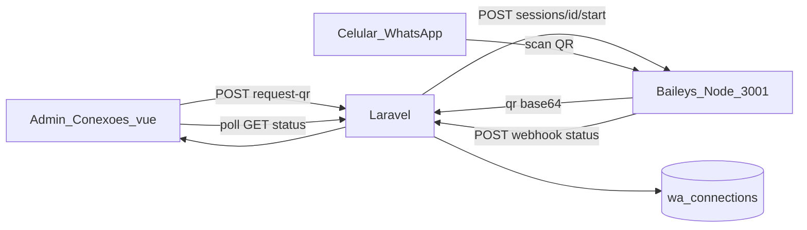
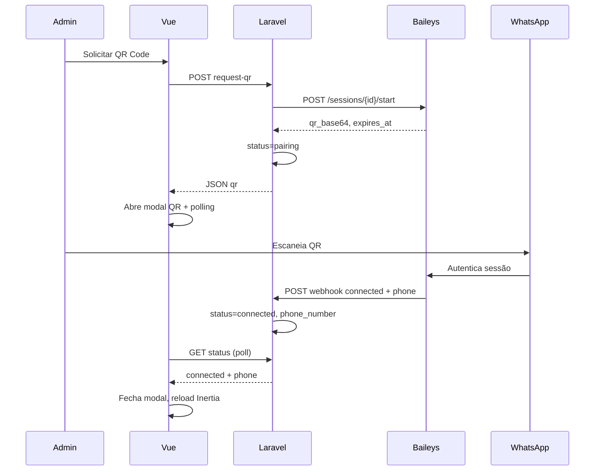

# Fluxo: Pareamento WhatsApp via QR Code (Baileys)

> **Tipo:** spec de implementação para IA (não implementar neste chat — apenas seguir este documento em uma execução dedicada)  
> **Escopo:** Fase 2 — ao clicar **Solicitar QR Code**, integrar com serviço Baileys, exibir QR no modal, detectar pareamento e atualizar card para **CONECTADO** com telefone. Inclui desconexão real e webhook de status.  
> **Pré-requisito:** Fase 1 concluída — [`docs/flow/WhatsApp/Conexoes.md`](Conexoes.md) (`wa_connections`, tela `/admin/whatsapp/conexoes`, cards, stub `BaileysClient`)  
> **Depende de:** `docs/database/schema.md` (`wa_connections`), `docs/features/atendimento.md`  
> **Stack Baileys:** Node.js 20+ · Express · `@whiskeysockets/baileys` · serviço separado do Laravel  
> **Rotas Laravel:** `POST /admin/whatsapp/conexoes/{connection}/request-qr` · `GET /admin/whatsapp/conexoes/{connection}/status` · `POST /admin/whatsapp/conexoes/{connection}/cancel-pairing` · `POST /webhooks/baileys/status`  
> **Rotas Baileys (interno):** `POST /sessions` · `POST /sessions/:id/start` · `GET /sessions/:id/status` · `POST /sessions/:id/disconnect` · `DELETE /sessions/:id`  
> **URL admin:** `http://127.0.0.1:8000/admin/whatsapp/conexoes`  
> **URL serviço Baileys:** `http://127.0.0.1:3001` (env `BAILEYS_SERVICE_URL`)

---

## Regra de produto (resumo)

| Ação | Resultado |
|------|-----------|
| Card **Desconectado** → **Solicitar QR Code** | Laravel cria/inicia sessão Baileys; modal central exibe QR; card passa a **PAREAMENTO** |
| Admin escaneia QR no celular | Baileys autentica; webhook atualiza Laravel; card vira **CONECTADO** com telefone |
| Modal aberto durante pareamento | Polling a cada 3s confirma status; ao conectar, modal fecha sozinho + toast de sucesso |
| QR expira (~60s Baileys) | Modal exibe countdown; botão **Gerar novo QR** chama `request-qr` novamente |
| **Cancelar pareamento** no modal ou card | Encerra tentativa; status volta a **Desconectado**; sessão Baileys limpa pareamento pendente |
| **Desconectar** (card conectado) | Baileys encerra sessão; status `disconnected`; telefone removido |
| Serviço Baileys offline | Erro amigável: *"Serviço WhatsApp indisponível. Tente novamente."* |

**Frase única:** o admin pareia o WhatsApp escaneando um QR Code gerado pelo Baileys; quando a sessão abre, a plataforma registra o número e o canal fica pronto para atendimento (mensagens entram na Fase 3).

**Acesso:** inalterado — somente `role:admin` nas rotas admin; webhook Baileys protegido por secret compartilhado.

---

## Objetivo

1. **Serviço Node Baileys:** processo dedicado que mantém sockets WhatsApp por `connection_id`.
2. **Solicitar QR:** substituir stub de `requestQr` por integração real Laravel → Baileys.
3. **Modal QR:** exibir imagem base64, instruções e countdown; polling até conectar ou cancelar.
4. **Status conectado:** persistir `phone_number`, `connection_status = connected`, `last_status_at`.
5. **Desconectar real:** encerrar socket Baileys e limpar credenciais de pareamento pendente.
6. **Webhook:** Baileys notifica Laravel em mudanças de status (connected / disconnected).

---

## Glossário

| Termo | Significado |
|-------|-------------|
| **Sessão Baileys** | Instância `makeWASocket` no Node, identificada por `baileys_session_id` (= `wa_connections.id` no MVP) |
| **QR Code** | String escaneável emitida pelo evento `connection.update` do Baileys (`qr`) |
| **Pairing** | `connection_status = 'pairing'` — QR exibido, aguardando scan |
| **Auth state** | Credenciais salvas em disco (`services/baileys/sessions/{id}/`) para reconexão |
| **Webhook interno** | `POST /webhooks/baileys/status` — Baileys → Laravel, header `X-Baileys-Secret` |

---

## Estado atual do repositório (para a IA)

| Item | Status |
|------|--------|
| Fase 1 — tela Conexões | **Implementada** — `Conexoes.vue`, `WaConnectionCard.vue`, `ConnectionsController` |
| `requestQr` | **Stub** — flash *"Pareamento via QR Code será habilitado em breve."* |
| `BaileysClient` | **Stub** — métodos no-op / retornam null |
| `disconnect` | Atualiza banco; **não** chama Baileys |
| `destroy` | Remove registro; **não** encerra sessão Baileys |
| Card `pairing` | **Não tratado** no Vue — só `connected` / `disconnected` |
| Serviço Node `services/baileys/` | **Não existe** |
| Modal QR | **Não existe** |
| Rota poll status conexão | **Não existe** |
| Webhook Baileys | **Não existe** |

---

## Ordem de implementação (IA)

1. **Serviço Node:** criar `services/baileys/` com Express + Baileys + gerenciador de sessões.
2. **Env:** `BAILEYS_SERVICE_URL`, `BAILEYS_WEBHOOK_SECRET`, `BAILEYS_WEBHOOK_URL` (Laravel URL para callback).
3. **Backend Laravel:** implementar `BaileysClient` real (HTTP).
4. **Backend Laravel:** `requestQr`, `status`, `cancelPairing` no `ConnectionsController`.
5. **Backend Laravel:** `BaileysWebhookController` + rota pública com validação de secret.
6. **Backend Laravel:** `disconnect` e `destroy` chamando Baileys de verdade.
7. **Frontend:** `WaQrCodeModal.vue` + polling; atualizar `WaConnectionCard` para estado `pairing`.
8. **Frontend:** trocar `handleRequestQr` de Inertia redirect para `axios` + abrir modal.
9. **Dev:** script npm/concurrently para subir Baileys junto ao stack (documentar no README).
10. **Testar** cenários da seção [Critérios de aceite](#critérios-de-aceite).

---

## Arquitetura



### Sequência — solicitar QR até conectar



---

## Gatilho — admin (fluxo completo)

1. Admin em `/admin/whatsapp/conexoes` vê card **DESCONECTADO** com botão **Solicitar QR Code**.
2. Clica **Solicitar QR Code**.
3. Frontend chama `POST /admin/whatsapp/conexoes/{id}/request-qr` via **axios** (JSON, não Inertia redirect).
4. Laravel garante sessão Baileys (`createSession` se `baileys_session_id` null); chama `start` no serviço Node.
5. Resposta JSON: `{ qr_base64, expires_at, connection_status: 'pairing' }`.
6. Modal **Parear WhatsApp** abre no centro com QR, instruções e countdown.
7. Card na grid atualiza para **PAREAMENTO** (reload parcial ou prop local).
8. Admin abre WhatsApp no celular → **Aparelhos conectados** → **Conectar aparelho** → escaneia QR.
9. Baileys recebe autenticação → envia webhook `connected` + `phone_number` E.164.
10. Polling detecta `connected` → modal fecha → toast *"WhatsApp conectado com sucesso."* → card exibe **CONECTADO**, telefone e **Desconectar**.

---

## Serviço Node — `services/baileys/`

### Estrutura de pastas

```
services/baileys/
├── package.json
├── .env.example
├── src/
│   ├── index.js              # Express app, porta 3001
│   ├── config.js             # env vars
│   ├── sessionManager.js     # Map connectionId → socket + state
│   ├── webhook.js            # notify Laravel
│   └── routes/
│       └── sessions.js
└── sessions/                 # gitignore — auth creds por connection id
    └── {connectionId}/
        └── creds.json
```

### Dependências (`package.json`)

| Pacote | Uso |
|--------|-----|
| `@whiskeysockets/baileys` | Socket WhatsApp |
| `express` | HTTP API |
| `pino` | Logs Baileys |
| `qrcode` | Opcional — converter string QR em PNG base64 |
| `dotenv` | Config |

### Variáveis de ambiente

| Variável | Exemplo | Descrição |
|----------|---------|-----------|
| `PORT` | `3001` | Porta HTTP |
| `LARAVEL_WEBHOOK_URL` | `http://127.0.0.1:8000/webhooks/baileys/status` | Callback status |
| `BAILEYS_WEBHOOK_SECRET` | string longa aleatória | Mesmo valor no Laravel `.env` |
| `SESSIONS_DIR` | `./sessions` | Pasta credenciais |

### API interna — contratos

#### `POST /sessions`

Cria registro de sessão (idempotente se já existir).

**Body:**

```json
{ "connection_id": "550e8400-e29b-41d4-a716-446655440000" }
```

**Resposta `201`:**

```json
{ "session_id": "550e8400-e29b-41d4-a716-446655440000", "status": "disconnected" }
```

#### `POST /sessions/:id/start`

Inicia socket Baileys e aguarda QR (ou reconecta se creds existem).

**Resposta `200` — QR pendente:**

```json
{
  "status": "pairing",
  "qr_base64": "data:image/png;base64,iVBOR...",
  "qr_raw": "2@...",
  "expires_at": "2026-05-24T08:14:00.000Z"
}
```

**Resposta `200` — já autenticado (creds salvas):**

```json
{
  "status": "connected",
  "phone_number": "5514981706236"
}
```

**Erros:**

| HTTP | Quando |
|------|--------|
| 404 | `session_id` desconhecido |
| 409 | Sessão já em pareamento ativo |
| 500 | Falha ao iniciar socket |

#### `GET /sessions/:id/status`

```json
{
  "status": "disconnected|pairing|connected",
  "phone_number": "5514981706236",
  "qr_base64": null,
  "expires_at": null
}
```

Durante `pairing`, incluir `qr_base64` e `expires_at` se QR ainda válido.

#### `POST /sessions/:id/disconnect`

Encerra socket; **mantém** creds em disco (logout soft — permite reconectar sem QR se creds válidas).

Para forçar novo QR: usar `DELETE /sessions/:id` ou flag `clear_auth: true`.

**Body opcional:**

```json
{ "clear_auth": true }
```

Com `clear_auth: true`: apaga pasta `sessions/{id}/` — próximo start exige QR novo.

**Resposta:**

```json
{ "status": "disconnected" }
```

#### `DELETE /sessions/:id`

Remove sessão da memória e apaga creds do disco.

---

### Lógica Baileys — `sessionManager.js`

Pseudocódigo essencial:

```js
import makeWASocket, { useMultiFileAuthState, DisconnectReason } from '@whiskeysockets/baileys';

async function startSession(connectionId) {
  const { state, saveCreds } = await useMultiFileAuthState(`sessions/${connectionId}`);

  const sock = makeWASocket({
    auth: state,
    printQRInTerminal: false,
    // browser name visível no celular: ['4Foods', 'Chrome', '1.0']
  });

  sock.ev.on('creds.update', saveCreds);

  sock.ev.on('connection.update', async (update) => {
    const { connection, lastDisconnect, qr } = update;

    if (qr) {
      // guardar qr_raw + gerar qr_base64 PNG
      session.qr = qr;
      session.status = 'pairing';
      session.qrExpiresAt = new Date(Date.now() + 60_000);
    }

    if (connection === 'open') {
      const phone = sock.user?.id?.split(':')[0]?.replace(/\D/g, '');
      session.status = 'connected';
      session.phoneNumber = phone;
      session.qr = null;
      await notifyLaravel({ connection_id: connectionId, status: 'connected', phone_number: phone });
    }

    if (connection === 'close') {
      const code = lastDisconnect?.error?.output?.statusCode;
      session.status = 'disconnected';
      await notifyLaravel({ connection_id: connectionId, status: 'disconnected', phone_number: null });

      // Reconnect automático só se creds válidas e não foi logout manual
      if (code !== DisconnectReason.loggedOut && !session.manualDisconnect) {
        startSession(connectionId);
      }
    }
  });

  return sock;
}
```

**Regras:**

| Regra | Detalhe |
|-------|---------|
| `connection_id` = UUID Laravel | Usar `wa_connections.id` como `baileys_session_id` |
| QR expiry | Baileys renova QR ~ a cada 20–60s; serviço atualiza `qr_base64` e notifica via poll |
| Browser name | `['4Foods', 'Desktop', '1.0.0']` |
| Um socket por connection | Map em memória; não duplicar `start` |

---

### Webhook Node → Laravel

**Arquivo:** `src/webhook.js`

```js
await fetch(process.env.LARAVEL_WEBHOOK_URL, {
  method: 'POST',
  headers: {
    'Content-Type': 'application/json',
    'X-Baileys-Secret': process.env.BAILEYS_WEBHOOK_SECRET,
  },
  body: JSON.stringify({
    connection_id: connectionId,
    status: 'connected',           // connected | disconnected | pairing
    phone_number: '5514981706236', // null se disconnected
  }),
});
```

Retry: 3 tentativas com backoff 1s / 2s / 4s. Logar falha se Laravel indisponível (polling do frontend cobre inconsistência temporária).

---

## Backend Laravel — variáveis `.env`

```env
BAILEYS_SERVICE_URL=http://127.0.0.1:3001
BAILEYS_WEBHOOK_SECRET=sua-string-secreta-longa
```

Registrar em `config/services.php`:

```php
'baileys' => [
    'url' => env('BAILEYS_SERVICE_URL', 'http://127.0.0.1:3001'),
    'webhook_secret' => env('BAILEYS_WEBHOOK_SECRET'),
],
```

---

## Backend Laravel — `BaileysClient` (implementação real)

**Arquivo:** `app/Services/WhatsApp/BaileysClient.php`

Substituir stub por chamadas HTTP:

| Método | HTTP | Endpoint Baileys |
|--------|------|------------------|
| `createSession(string $connectionId)` | POST | `/sessions` body `{ connection_id }` |
| `startSession(string $sessionId)` | POST | `/sessions/{id}/start` |
| `getStatus(string $sessionId)` | GET | `/sessions/{id}/status` |
| `disconnect(string $sessionId, bool $clearAuth = false)` | POST | `/sessions/{id}/disconnect` |
| `deleteSession(string $sessionId)` | DELETE | `/sessions/{id}` |

**Timeout:** 15s em `start` (Baileys pode demorar); 5s nos demais.

**Exceções:** encapsular falhas de conexão em `BaileysServiceUnavailableException` → controller retorna 503 JSON.

```php
public function startSession(string $sessionId): array
{
    $response = Http::timeout(15)
        ->post("{$this->baseUrl}/sessions/{$sessionId}/start");

    $response->throw();

    return $response->json();
}
```

---

## Backend Laravel — rotas

### Admin (existentes + novas)

Em `routes/web.php`, grupo `role:admin`:

```php
Route::post('/conexoes/{connection}/request-qr', [ConnectionsController::class, 'requestQr']);
Route::get('/conexoes/{connection}/status', [ConnectionsController::class, 'status'])->name('conexoes.status');
Route::post('/conexoes/{connection}/cancel-pairing', [ConnectionsController::class, 'cancelPairing'])->name('conexoes.cancelPairing');
```

### Webhook (público, fora de `firebase.auth`)

```php
Route::post('/webhooks/baileys/status', [BaileysWebhookController::class, 'handle'])
    ->name('webhooks.baileys.status');
```

Registrar **antes** ou **fora** do middleware `firebase.auth`.

---

## Backend Laravel — `ConnectionsController` (alterações)

### `requestQr` — substituir stub

| Item | Valor |
|------|-------|
| Método / URI | `POST /admin/whatsapp/conexoes/{connection}/request-qr` |
| Auth | `role:admin` |
| Resposta | **JSON** `200` (frontend usa axios, header `Accept: application/json`) |

**Fluxo:**

```php
public function requestQr(string $connection, BaileysClient $baileys)
{
    $record = DB::table('wa_connections')->where('id', $connection)->first();
    abort_unless($record, 404);

    if ($record->connection_status === 'connected') {
        return response()->json(['message' => 'Conexão já está ativa.'], 409);
    }

  try {
    $sessionId = $record->baileys_session_id ?? $record->id;

    if (! $record->baileys_session_id) {
        $baileys->createSession($record->id);
        DB::table('wa_connections')->where('id', $connection)->update([
            'baileys_session_id' => $record->id,
            'updated_at' => now(),
        ]);
    }

    $result = $baileys->startSession($sessionId);

    if (($result['status'] ?? '') === 'connected') {
        // Creds existentes — reconectou sem QR
        DB::table('wa_connections')->where('id', $connection)->update([
            'connection_status' => 'connected',
            'phone_number' => $result['phone_number'],
            'last_status_at' => now(),
            'updated_at' => now(),
        ]);

        return response()->json([
            'connection_status' => 'connected',
            'phone_number' => $result['phone_number'],
            'qr_base64' => null,
        ]);
    }

    DB::table('wa_connections')->where('id', $connection)->update([
        'connection_status' => 'pairing',
        'last_status_at' => now(),
        'updated_at' => now(),
    ]);

    return response()->json([
        'connection_status' => 'pairing',
        'qr_base64' => $result['qr_base64'],
        'expires_at' => $result['expires_at'],
    ]);
  } catch (BaileysServiceUnavailableException $e) {
    return response()->json(['message' => 'Serviço WhatsApp indisponível. Tente novamente.'], 503);
  }
}
```

### `status` — polling

| Item | Valor |
|------|-------|
| Método / URI | `GET /admin/whatsapp/conexoes/{connection}/status` |
| Resposta | JSON |

```json
{
  "connection_status": "pairing",
  "phone_number": null,
  "qr_base64": "data:image/png;base64,...",
  "expires_at": "2026-05-24T08:14:00.000Z",
  "last_status_at": "2026-05-24T08:13:00.000Z"
}
```

**Lógica:**

1. Ler `wa_connections` do banco (fonte primária após webhook).
2. Se status `pairing`, opcionalmente sincronizar com `BaileysClient::getStatus` para QR renovado.
3. Se Baileys reporta `connected` e banco ainda `pairing`, atualizar banco (fallback se webhook falhou).

### `cancelPairing`

| Item | Valor |
|------|-------|
| Método / URI | `POST /admin/whatsapp/conexoes/{connection}/cancel-pairing` |
| Resposta | JSON `{ "connection_status": "disconnected" }` |

```php
$baileys->disconnect($sessionId, clearAuth: false);
DB::table('wa_connections')->where('id', $connection)->update([
    'connection_status' => 'disconnected',
    'last_status_at' => now(),
    'updated_at' => now(),
]);
```

### `disconnect` — implementar Baileys real

Descomentar e implementar:

```php
$baileys->disconnect($record->baileys_session_id ?? $record->id, clearAuth: true);
```

`clearAuth: true` força novo QR na próxima conexão.

### `destroy` — encerrar sessão antes de delete

```php
if ($record->baileys_session_id) {
    $baileys->deleteSession($record->baileys_session_id);
}
```

---

## Backend Laravel — `BaileysWebhookController`

**Arquivo:** `app/Http/Controllers/Webhooks/BaileysWebhookController.php`

```php
public function handle(Request $request)
{
    $secret = $request->header('X-Baileys-Secret');
    abort_unless($secret && hash_equals(config('services.baileys.webhook_secret'), $secret), 401);

    $validated = $request->validate([
        'connection_id' => ['required', 'uuid'],
        'status' => ['required', 'in:connected,disconnected,pairing'],
        'phone_number' => ['nullable', 'string', 'max:20'],
    ]);

    $update = [
        'connection_status' => $validated['status'],
        'last_status_at' => now(),
        'updated_at' => now(),
    ];

    if ($validated['status'] === 'connected' && ! empty($validated['phone_number'])) {
        $update['phone_number'] = $validated['phone_number'];
    }

    if ($validated['status'] === 'disconnected') {
        $update['phone_number'] = null;
    }

    DB::table('wa_connections')
        ->where('id', $validated['connection_id'])
        ->update($update);

    return response()->json(['ok' => true]);
}
```

---

## UI — modal QR Code (`WaQrCodeModal.vue`)

### Gatilho

`Conexoes.vue` — após `POST request-qr` com sucesso → `qrModalConnectionId = id` + props QR.

### Shell

Reutilizar `admin-modal-overlay` + `admin-modal` (tema **branco**, consistente com Conexões).

```
┌──────────────────────────────────────────────┐
│  Parear WhatsApp                         [X] │
│  Comercial 2                                 │
├──────────────────────────────────────────────┤
│                                              │
│         ┌─────────────────────┐              │
│         │                     │              │
│         │    [ QR CODE ]      │              │
│         │                     │              │
│         └─────────────────────┘              │
│                                              │
│  1. Abra o WhatsApp no celular               │
│  2. Toque em Menu ⋮ → Aparelhos conectados   │
│  3. Toque em Conectar aparelho               │
│  4. Aponte a câmera para este QR Code        │
│                                              │
│  Expira em: 0:45                             │
│                                              │
├──────────────────────────────────────────────┤
│  [ Cancelar pareamento ]  [ Gerar novo QR ]  │
└──────────────────────────────────────────────┘
```

### Props

```js
defineProps({
  connection: { type: Object, required: true },
  qrBase64: { type: String, default: null },
  expiresAt: { type: String, default: null },
});
```

### Comportamento

| Elemento | Regra |
|----------|-------|
| Imagem QR | `` — min 240px, max 280px |
| Countdown | Calculado de `expires_at`; ao zerar, texto *"QR expirado"* + habilitar **Gerar novo QR** |
| **Gerar novo QR** | Re-emite `POST request-qr`; substitui imagem |
| **Cancelar pareamento** | `POST cancel-pairing`; fecha modal |
| **X** / overlay / Esc | Igual cancelar pareamento |
| Loading inicial | Spinner enquanto aguarda resposta do `request-qr` |
| Erro 503 | Mensagem *"Serviço WhatsApp indisponível"* + botão **Tentar novamente** |

### Polling (enquanto modal aberto)

```js
const POLL_MS = 3000;

onMounted(() => {
  pollTimer = setInterval(async () => {
    const { data } = await axios.get(`/admin/whatsapp/conexoes/${id}/status`);
    if (data.connection_status === 'connected') {
      clearInterval(pollTimer);
      emit('paired');
      router.reload({ only: ['connections'], preserveScroll: true });
    }
    if (data.qr_base64 && data.qr_base64 !== qrBase64.value) {
      qrBase64.value = data.qr_base64; // QR renovado pelo Baileys
      expiresAt.value = data.expires_at;
    }
  }, POLL_MS);
});

onUnmounted(() => clearInterval(pollTimer));
```

Usar `document.visibilityState` — pausar poll se aba em background.

---

## UI — alterações em componentes existentes

### `Conexoes.vue`

**Substituir** `handleRequestQr`:

```js
import axios from 'axios';

const qrModal = ref(null); // { connection, qrBase64, expiresAt }

async function handleRequestQr(id) {
  const connection = props.connections.find(c => c.id === id);
  qrModal.value = { connection, qrBase64: null, expiresAt: null, loading: true };

  try {
    const { data } = await axios.post(`/admin/whatsapp/conexoes/${id}/request-qr`);

    if (data.connection_status === 'connected') {
      router.reload({ only: ['connections'], preserveScroll: true });
      return;
    }

    qrModal.value = { connection, ...data, loading: false };
  } catch (e) {
    qrModal.value = { connection, error: e.response?.data?.message ?? 'Erro ao gerar QR.', loading: false };
  }
}
```

Instalar/usar axios (já em devDependencies do projeto).

### `WaConnectionCard.vue`

Adicionar estado `pairing`:

| `connection_status` | Título | Descrição | Footer |
|---------------------|--------|-----------|--------|
| `pairing` | **PAREAMENTO** | Escaneie o QR Code no celular | **Cancelar pareamento** (secondary) |

Clique em **Cancelar pareamento** emite `@cancel-pairing`.

Atualizar ícone `.wa-card-status-icon.pairing` — cor amarelo/laranja (`#f59e0b`).

Formatar telefone exibido: E.164 → `+55 14 98170-6236` (helper `formatPhoneE164`).

---

## Regras de negócio

| Regra | Detalhe |
|-------|---------|
| Uma sessão por conexão | `baileys_session_id` = `wa_connections.id` |
| QR só se desconectado | `request-qr` retorna 409 se já `connected` |
| Reconexão automática | Se creds válidas em disco, `start` retorna `connected` sem QR |
| Desconectar limpa auth | `clear_auth: true` — exige novo QR |
| Webhook + poll | Webhook é fonte primária; poll é fallback UX |
| Secret obrigatório | Webhook rejeita sem `X-Baileys-Secret` válido |
| Baileys offline | 503 — não alterar status no banco |
| Múltiplas conexões | Cada card pareia independentemente |

---

## Dev — como subir o stack

```bash
# Terminal 1 — Laravel
php artisan serve

# Terminal 2 — Baileys
cd services/baileys
npm install
cp .env.example .env
npm run dev

# Terminal 3 — Vite
npm run dev
```

**Health check Baileys:** `GET http://127.0.0.1:3001/health` → `{ "ok": true }` (implementar rota simples).

**Ngrok (opcional):** webhook funciona em localhost porque Baileys e Laravel rodam na mesma máquina em dev. Em produção, `LARAVEL_WEBHOOK_URL` aponta para domínio público.

---

## Fora de escopo (Fase 2)

- Recebimento de mensagens inbound → `wa_tickets` (Fase 3)
- Envio de mensagens outbound
- Inbox real (substituir mock)
- Multi-tenant / múltiplos restaurantes
- Pairing code (alternativa ao QR)
- Reconexão automática documentada para produção (supervisor systemd / PM2)

---

## Mapa de arquivos

| Arquivo | Ação |
|---------|------|
| `docs/flow/WhatsApp/QrCode.md` | Este documento |
| `services/baileys/` | **Adicionar** — serviço Node completo |
| `app/Services/WhatsApp/BaileysClient.php` | **Alterar** — implementação HTTP real |
| `app/Exceptions/BaileysServiceUnavailableException.php` | **Adicionar** |
| `app/Http/Controllers/Admin/WhatsApp/ConnectionsController.php` | **Alterar** — requestQr, status, cancelPairing, disconnect, destroy |
| `app/Http/Controllers/Webhooks/BaileysWebhookController.php` | **Adicionar** |
| `config/services.php` | **Alterar** — seção `baileys` |
| `routes/web.php` | **Alterar** — rotas status, cancel-pairing, webhook |
| `.env.example` | **Alterar** — vars Baileys |
| `resources/js/Components/WaQrCodeModal.vue` | **Adicionar** |
| `resources/js/Components/styles/WaQrCodeModal.css` | **Adicionar** |
| `resources/js/Pages/Admin/WhatsApp/Conexoes.vue` | **Alterar** — axios + modal |
| `resources/js/Components/WaConnectionCard.vue` | **Alterar** — estado pairing |
| `resources/js/Components/styles/WaConnectionCard.css` | **Alterar** — estilos pairing |
| `resources/js/utils/formatPhoneE164.js` | **Adicionar** — opcional |

---

## Critérios de aceite

- [ ] Serviço Baileys sobe em `:3001` com `GET /health` ok
- [ ] **Solicitar QR Code** abre modal com imagem QR (base64) e instruções
- [ ] Card muda para **PAREAMENTO** ao solicitar QR
- [ ] Escanear QR no celular conecta WhatsApp; card vira **CONECTADO** com telefone formatado
- [ ] Modal fecha automaticamente ao detectar `connected` (poll ou webhook)
- [ ] QR expirado permite **Gerar novo QR** sem fechar modal
- [ ] **Cancelar pareamento** volta card para **DESCONECTADO**
- [ ] **Desconectar** encerra sessão Baileys (`clear_auth`) e limpa telefone
- [ ] **Excluir** conexão remove sessão Baileys do disco
- [ ] Baileys offline → mensagem de erro 503, sem crash
- [ ] Webhook rejeita requests sem secret válido (401)
- [ ] Reconexão com creds salvas conecta sem QR (cenário reabrir após restart Node)
- [ ] Polling pausa com aba em background

---

## Cenários de teste manual

| # | Passos | Resultado esperado |
|---|--------|-------------------|
| 1 | Baileys off → Solicitar QR | Modal erro 503; status permanece disconnected |
| 2 | Baileys on → Solicitar QR | Modal com QR; card PAREAMENTO |
| 3 | Escanear QR com celular | Webhook/poll → CONECTADO; telefone no card |
| 4 | Aguardar QR expirar (~60s) | Countdown zera; Gerar novo QR funciona |
| 5 | Cancelar pareamento | Modal fecha; card DESCONECTADO |
| 6 | Conectado → Desconectar | Card DESCONECTADO; telefone sumiu |
| 7 | Desconectado → Solicitar QR novamente | Novo QR exibido |
| 8 | Conectado → Excluir conexão | Card removido; sessão apagada no Node |
| 9 | Restart Node com creds salvas → Solicitar QR | Conecta direto sem QR |
| 10 | POST webhook sem secret | 401 Unauthorized |

---

## Referências cruzadas

| Documento | Relação |
|-----------|---------|
| [`docs/flow/WhatsApp/Conexoes.md`](Conexoes.md) | Fase 1 — tela, cards, CRUD, stubs |
| `docs/database/schema.md` | `wa_connections` |
| `docs/features/atendimento.md` | Inbox — Fase 3 consumirá conexão ativa |
| [`Baileys`](https://github.com/WhiskeySockets/Baileys) | Documentação da biblioteca |
| `docs/flow/tablets/pedidoCozinha.md` | Padrão polling (referência `OrdersController@poll`) |

---

## Fase 3 — Atendimentos (inbox real)

Ver spec completa: [`docs/flow/WhatsApp/Atendimentos.md`](Atendimentos.md)

| Entrega | Descrição |
|---------|-----------|
| Evento `messages.upsert` Baileys | Criar/atualizar `wa_tickets` e `wa_messages` |
| Webhook mensagens | Baileys → Laravel |
| Inbox real | Substituir mock em `InboxController` |
| Botão Atender + chat | Triagem → Em andamento |

---

## Fase 4 — preview (envio de respostas)

Documento futuro sugerido: `docs/flow/WhatsApp/Respostas.md`
