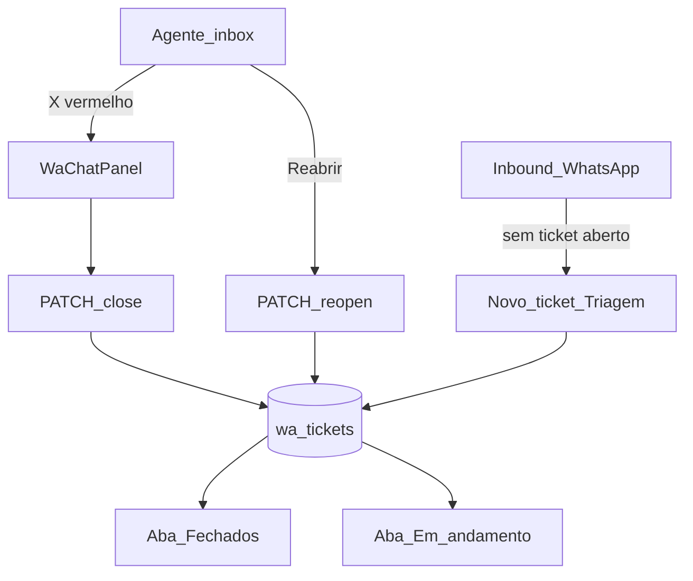
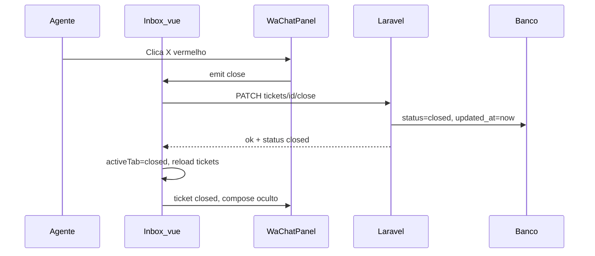
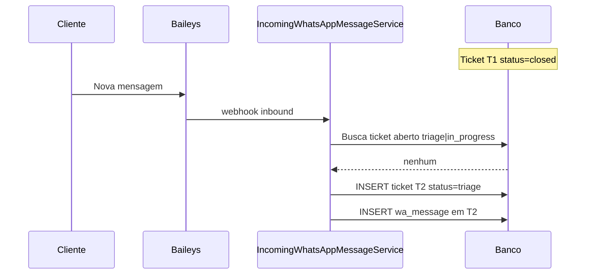

# Fluxo: Fechamento e reabertura de tickets WhatsApp

> **Tipo:** spec de implementação para IA (não implementar neste chat — apenas seguir este documento em uma execução dedicada)  
> **Escopo:** encerrar atendimento pelo painel de chat (ícone **X** vermelho), mover ticket para aba **Fechados**, permitir **reabrir** o mesmo ticket e, quando não reaberto, criar **novo ticket em Triagem** se o mesmo contato enviar mensagem.  
> **Pré-requisito:** [`docs/flow/WhatsApp/Atendimentos.md`](Atendimentos.md) (inbox real, chat, webhook inbound)  
> **Depende de:** `docs/features/atendimento.md`, `docs/database/schema.md` (`wa_tickets`, `wa_messages`)  
> **Rotas novas:** `PATCH /whatsapp/inbox/tickets/{ticket}/close` · `PATCH /whatsapp/inbox/tickets/{ticket}/reopen`  
> **URL inbox:** `http://127.0.0.1:8000/whatsapp/inbox`  
> **Roles:** `admin|whatsapp_agent`

---

## Regra de produto (resumo)

| Ação | Resultado |
|------|-----------|
| Agente clica no **X vermelho** (canto superior direito do chat) com ticket **Em andamento** | Ticket `status → closed`; some da aba **Em andamento**; aparece na aba **Fechados**; UI troca para aba **Fechados** com o ticket ainda selecionado |
| Agente visualiza ticket **Fechado** | Histórico de mensagens em leitura; sem campo de envio; badge **Fechado**; botão **Reabrir atendimento** visível |
| Agente clica **Reabrir atendimento** | Ticket `status → in_progress`; volta para aba **Em andamento**; chat editável (envio habilitado); `agent_id` mantido ou atualizado para o usuário logado |
| Cliente envia nova mensagem com ticket **fechado** (sem reabrir) | **Não** reutiliza o ticket fechado — `IncomingWhatsAppMessageService` cria **novo** ticket em **Triagem** para o mesmo telefone |
| Cliente envia mensagem com ticket **reaberto** (`in_progress`) | Append na mensagem no **mesmo** ticket (comportamento já existente) |

**Frase única:** o agente encerra pelo X vermelho; o chamado vai para Fechados e pode ser reaberto; se o cliente voltar a falar sem reabertura, nasce um novo ciclo em Triagem.

**Acesso:** `role:admin|whatsapp_agent` (mesmo grupo de rotas da inbox).

---

## Objetivo

1. **UI:** botão **Fechar atendimento** (ícone X vermelho) no header do painel de chat (`WaChatPanel`), apenas em `in_progress`.
2. **Backend:** endpoint `close` que persiste `status = closed` e atualiza `updated_at`.
3. **UI pós-fechamento:** trocar aba ativa para **Fechados**, manter ticket selecionado, exibir histórico somente leitura.
4. **Reabertura:** botão e endpoint `reopen` que restaura `in_progress`.
5. **Inbound:** garantir que mensagem após fechamento **sem** reabertura sempre cria ticket novo em triagem (já coberto pela query de ticket aberto; validar em testes).

---

## Glossário

| Termo | Significado |
|-------|-------------|
| **Fechar** | Transição `in_progress` → `closed` iniciada pelo agente |
| **Reabrir** | Transição `closed` → `in_progress` no **mesmo** registro `wa_tickets` |
| **Ticket aberto** | `status IN ('triage', 'in_progress')` — único por telefone para roteamento inbound |
| **Novo ciclo** | Novo `wa_tickets.id` em `triage` quando o último ticket do telefone está `closed` |

---

## Estado atual do repositório (para a IA)

| Item | Status |
|------|--------|
| `WaChatPanel.vue` | Header com avatar, nome, badge **Fechado** — **sem** botão X nem Reabrir |
| `Inbox.vue` | Abas + chat para `in_progress` e `closed` — **sem** handlers close/reopen |
| `InboxController@accept` | Existe — padrão para novos endpoints |
| `PATCH .../close` / `.../reopen` | **Não existem** |
| `IncomingWhatsAppMessageService` | Busca só `triage` \| `in_progress` — ticket `closed` **não** recebe append (cria novo ticket no `else`) |
| Lista **Fechados** | Query já filtra `closed` com `DATE(updated_at) = hoje` em `buildTicketsGrouped()` |

---

## Ordem de implementação (IA)

1. **Backend:** `InboxController@close` e `@reopen` + rotas em `web.php`.
2. **Frontend:** botão X vermelho no `WaChatPanel` + emit `close` → `Inbox.vue`.
3. **Frontend:** após close — `router.reload` tickets, `activeTab = 'closed'`, manter `selectedId`.
4. **Frontend:** botão **Reabrir atendimento** no header quando `status === 'closed'`.
5. **Poll:** incluir `closed_ids` no `poll()` (opcional, recomendado) para detectar fechamentos de outros agentes.
6. **Testar** cenários da seção [Critérios de aceite](#critérios-de-aceite).

---

## Fluxo ponta a ponta



### Sequência — fechar atendimento



### Sequência — nova mensagem após fechado (sem reabrir)



---

## Regras de negócio

### Quem pode fechar

| Situação | Permitido |
|----------|-----------|
| `status = in_progress` | **Sim** — qualquer `whatsapp_agent` ou `admin` autenticado |
| `status = triage` | **Não** — não há botão X na UI de triagem (só **Atender** ou aguardar) |
| `status = closed` | **Não** — já fechado |

> Opcional futuro: restringir close ao `agent_id` do ticket. **MVP:** qualquer agente com acesso à inbox pode fechar ticket em andamento.

### Efeitos do fechamento

| Campo | Valor após close |
|-------|------------------|
| `status` | `closed` |
| `updated_at` | `now()` |
| `agent_id` | **Mantém** o agente que assumiu (histórico de responsabilidade) |

- Mensagens existentes permanecem vinculadas ao mesmo `wa_ticket_id`.
- Campo de composição (envio) **desabilitado** / oculto no painel.
- Ticket **não** aparece mais na aba **Em andamento**.
- Ticket aparece na aba **Fechados** (respeitando filtro do dia na listagem — ver abaixo).

### Reabertura

| Campo | Valor após reopen |
|-------|-------------------|
| `status` | `in_progress` |
| `updated_at` | `now()` |
| `agent_id` | `auth()->id()` (usuário que reabriu) |

- UI troca para aba **Em andamento** e mantém o ticket selecionado.
- Envio de mensagens volta a funcionar (`POST .../send`).
- O ticket reaberto passa a ser o **ticket aberto** daquele telefone — novas mensagens inbound vão para ele, não criam triagem nova.

### Nova mensagem sem reabertura (mesmo contato)

Alinhado a [`Atendimentos.md`](Atendimentos.md#regras-de-negócio--tickets-e-mensagens):

| Situação | Ação |
|----------|------|
| Último ticket do telefone = `closed` | Criar **novo** `wa_ticket` com `status = triage`, `agent_id = null` |
| Existe ticket `triage` ou `in_progress` para o telefone | Reutilizar (append mensagem) |

**Importante:** nunca alterar `status` do ticket fechado para `triage` por mensagem inbound — sempre novo registro.

### Listagem na aba Fechados

Manter regra atual do `InboxController::buildTicketsGrouped()`:

- Exibir fechados com `DATE(updated_at) = CURDATE()` (data do fechamento/reabertura mais recente).
- Ordenação: `updated_at DESC`.

Se o ticket for reaberto e fechado de novo no mesmo dia, continua na lista com horário atualizado.

---

## UI — painel de chat (`WaChatPanel.vue`)

### Header — layout

```
┌─────────────────────────────────────────────────────────────────┐
│ (AV)  Maria Silva                    [Fechado]  [Reabrir]  [ X ] │
│       +55 14 99988-7766                                         │
└─────────────────────────────────────────────────────────────────┘
```

| Elemento | Quando visível | Comportamento |
|----------|----------------|---------------|
| **X vermelho** | `ticket.status === 'in_progress'` | `aria-label="Fechar atendimento"`; ícone SVG ×; cor `#DC2626` (ou token vermelho do projeto); hover fundo `#FEE2E2` |
| Badge **Fechado** | `ticket.status === 'closed'` | Já existe — manter |
| Botão **Reabrir atendimento** | `ticket.status === 'closed'` | Outline ou secundário; texto curto **Reabrir** em telas estreitas |

Posicionamento: canto superior direito do `.chat-head`, após `.chat-contact` (`margin-left: auto` no grupo de ações).

### Confirmação antes de fechar (recomendado)

- Ao clicar no X: modal ou `confirm()` nativo — *"Encerrar este atendimento? O chamado irá para Fechados."*
- **Cancelar:** nada muda.
- **Confirmar:** dispara `PATCH close`.

MVP aceita `window.confirm` se não houver modal padrão na inbox.

### Comportamento em `Inbox.vue`

**Após close bem-sucedido:**

```js
activeTab.value = 'closed';
// selectedId permanece o mesmo
router.reload({ only: ['tickets'], preserveScroll: true });
// chatMessages mantidos ou refetch opcional
```

**Após reopen bem-sucedido:**

```js
activeTab.value = 'in_progress';
router.reload({ only: ['tickets'], preserveScroll: true });
```

### Estados do compose

| `ticket.status` | Campo de mensagem |
|-----------------|-------------------|
| `in_progress` | Visível (já implementado) |
| `closed` | **Oculto** (já implementado) |
| `triage` | Painel de triagem separado (sem chat compose) |

---

## Backend

### `PATCH /whatsapp/inbox/tickets/{ticket}/close`

**Controller:** `InboxController@close`

```php
public function close(string $ticket)
{
    $record = DB::table('wa_tickets')->where('id', $ticket)->first();
    abort_unless($record, 404);
    abort_if($record->status !== 'in_progress', 422, 'Ticket não está em atendimento.');

    DB::table('wa_tickets')->where('id', $ticket)->update([
        'status'     => 'closed',
        'updated_at' => now(),
    ]);

    return response()->json([
        'ok'     => true,
        'status' => 'closed',
        'id'     => $ticket,
    ]);
}
```

**Validações:**

| Código | Condição |
|--------|----------|
| 404 | Ticket inexistente |
| 422 | `status !== 'in_progress'` |

### `PATCH /whatsapp/inbox/tickets/{ticket}/reopen`

**Controller:** `InboxController@reopen`

```php
public function reopen(string $ticket)
{
    $record = DB::table('wa_tickets')->where('id', $ticket)->first();
    abort_unless($record, 404);
    abort_if($record->status !== 'closed', 422, 'Ticket não está fechado.');

    DB::table('wa_tickets')->where('id', $ticket)->update([
        'status'     => 'in_progress',
        'agent_id'   => auth()->id(),
        'updated_at' => now(),
    ]);

    return response()->json([
        'ok'     => true,
        'status' => 'in_progress',
        'id'     => $ticket,
    ]);
}
```

### Rotas (`routes/web.php`)

Dentro do grupo `whatsapp` + middleware `firebase.auth` + `role:admin|whatsapp_agent`:

```php
Route::patch('/inbox/tickets/{ticket}/close', [InboxController::class, 'close'])->name('inbox.close');
Route::patch('/inbox/tickets/{ticket}/reopen', [InboxController::class, 'reopen'])->name('inbox.reopen');
```

### Poll (melhoria opcional)

Em `InboxController@poll`, adicionar:

```php
'closed_ids' => DB::table('wa_tickets')
    ->where('status', 'closed')
    ->whereDate('updated_at', today())
    ->orderByDesc('updated_at')
    ->pluck('id'),
```

Comparar no frontend junto com `triage_ids` / `in_progress_ids` para reload quando outro agente fechar ticket.

### Inbound — sem alteração obrigatória

`IncomingWhatsAppMessageService` já ignora tickets `closed` na busca de ticket aberto. **Não** reabrir automaticamente no webhook.

Verificar em teste manual que dois tickets do mesmo telefone podem coexistir no banco (um `closed`, um `triage`) sem conflito de unique — `phone_number` **não** deve ter unique global na tabela.

---

## Frontend — arquivos

| Arquivo | Alteração |
|---------|-----------|
| `resources/js/Components/WaChatPanel.vue` | Botão X, botão Reabrir, emits `close` / `reopen`, estados loading |
| `resources/js/Components/styles/WaChatPanel.css` | `.chat-close-btn`, `.chat-reopen-btn` |
| `resources/js/Pages/WhatsApp/Inbox.vue` | Handlers `handleClose` / `handleReopen`, troca de aba |
| `app/Http/Controllers/WhatsApp/InboxController.php` | Métodos `close`, `reopen` |
| `routes/web.php` | Duas rotas PATCH |

### Exemplo — emit no `WaChatPanel`

```vue
const emit = defineEmits(['message-sent', 'close', 'reopen']);

// botão X
@click="emit('close')"

// botão Reabrir
@click="emit('reopen')"
```

### Exemplo — handler no `Inbox.vue`

```js
async function handleClose(ticketId) {
  if (!window.confirm('Encerrar este atendimento? O chamado irá para Fechados.')) return;
  try {
    await axios.patch(`/whatsapp/inbox/tickets/${ticketId}/close`);
    activeTab.value = 'closed';
    router.reload({ only: ['tickets'], preserveScroll: true });
  } catch (e) {
    // toast ou alert com e.response?.data?.message
  }
}
```

---

## Critérios de aceite

### Fechar

- [ ] Ticket `in_progress` exibe X vermelho no canto superior direito do chat
- [ ] Clicar X com confirmação altera `status` para `closed` no banco
- [ ] Ticket some de **Em andamento** e aparece em **Fechados**
- [ ] Após fechar, aba ativa = **Fechados** e ticket permanece selecionado com histórico
- [ ] Campo de envio não aparece em ticket fechado
- [ ] Fechar ticket em `triage` ou `closed` retorna 422

### Reabrir

- [ ] Ticket `closed` exibe botão **Reabrir atendimento**
- [ ] Reabrir volta `status` para `in_progress` e move para aba **Em andamento**
- [ ] Após reabrir, envio de mensagem funciona no mesmo ticket
- [ ] Reabrir ticket `in_progress` retorna 422

### Novo ciclo (inbound)

- [ ] Com ticket T1 `closed`, mensagem do mesmo telefone cria T2 `triage` (novo UUID)
- [ ] Mensagem inbound vai para `wa_messages` de T2, não de T1
- [ ] T1 permanece `closed` com histórico intacto
- [ ] Se T2 for atendido e depois fechado, comportamento de fechamento repete

### UX

- [ ] X vermelho com `aria-label` acessível
- [ ] Erro de API exibido ao usuário (não falhar silenciosamente)
- [ ] CSS do botão em `WaChatPanel.css` (não inline no `.vue`)

---

## Fora do escopo (nesta spec)

- Fechar ticket direto da aba **Triagem** sem passar por **Em andamento**
- Mensagem automática ao cliente (*"Seu atendimento foi encerrado"*)
- Motivo de fechamento / categorização
- Arquivar fechados de dias anteriores na inbox (filtro “hoje” permanece como está)
- Exclusão física de tickets

---

## Documentos relacionados

| Documento | Uso |
|-----------|-----|
| [`docs/flow/WhatsApp/Atendimentos.md`](Atendimentos.md) | Inbox real, inbound, triagem, accept |
| `docs/features/atendimento.md` | Layout abas, badge Novo, lista Fechados |
| `docs/database/schema.md` | Enum `wa_tickets.status`, regra “closed não recebe append” |
| `docs/project_overview.md` | Visão geral do fluxo agente → closed |

---

## Fase futura (preview)

| Entrega | Descrição |
|---------|-----------|
| Fechar só pelo agente dono | Validar `agent_id === auth()->id()` |
| Histórico Fechados | Ver tickets fechados de N dias na inbox |
| Atalho teclado | `Esc` no chat não fecha — evitar conflito |
